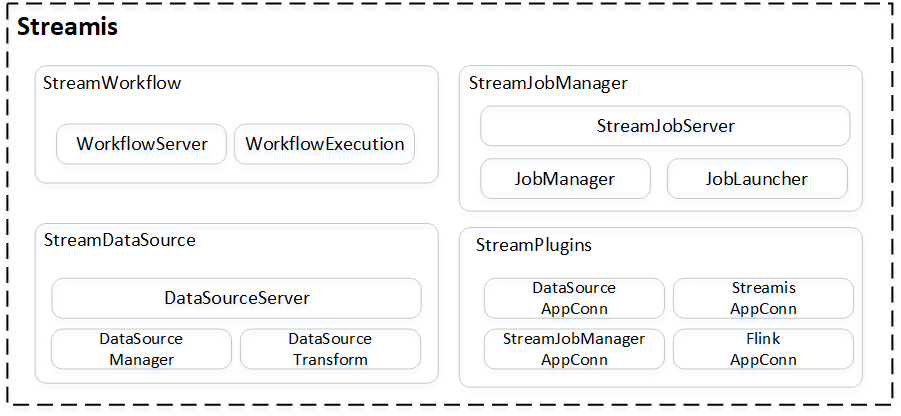

# Streamis

[English](README.md) | 中文

## 引言

 &nbsp; &nbsp; &nbsp; &nbsp;Streamis 是 **微众银行** 联合 **天翼云**、**仙翁科技** 和 **萨摩耶云** 联合共建的流式应用开发管理系统。

 &nbsp; &nbsp; &nbsp; &nbsp;基于 [DataSphere Studio](https://github.com/WeBankFinTech/DataSphereStudio) 的框架化能力，以及底层对接 [Linkis](https://github.com/apache/incubator-linkis) 的 **Flink 引擎**，让用户低成本完成流式应用的开发、调试、发布和生产管理。
 
 &nbsp; &nbsp; &nbsp; &nbsp;未来还规划将以工作流式的图形化拖拽开发体验，将流式应用以Source节点、
Dimension节点、Transform节点、Sink节点 和 [Visualis](https://github.com/WeBankFinTech/Visualis) 节点串连成一条流式工作流，让用户以更低的学习成本完成流式应用的开发、调试和发布。

----

## 核心特点

#### 基于 DSS 和 DSS-Scriptis，打造业界领先的流式应用开发管理系统。

#### 强大的流式应用开发调试能力，基于 DSS-Scriptis 提供流式应用的开发和调试功能，支持对 FlinkSQL 进行实时调试和结果集展示。

#### 强大的流式应用生产中心能力。支持流式作业的多版本管理、全生命周期管理、监控告警、checkpoint 和 savepoint 管理能力。

#### 基于 Linkis 计算中间件，打造金融级具备高并发、高可用、多租户隔离和资源管控等能力的流式生产中心。

----

## Streamis 功能介绍

 
| 功能模组 | 描述 | Streamis | 
 | :----: | :----: |-------|
 | 安装部署 | 部署难易程度和第三方依赖 | 一键部署，依赖Linkis Flink引擎 |
 | 开发中心| FlinkSQL 流式应用实时开发、调试 | 支持，需集成DSS | 
 | 生产中心 | 流式应用管理运维能力 | 支持 |
 |       | 复用 Linkis 计算治理能力 | 支持 |
 |       |支持 FlinkSQL 和 FlinkJar 包等方式发布 | 支持 |
 | 服务高可用 | 服务多点，故障不影响使用 | 应用高可用 | 
 | 系统管理 | 节点、资源管理 | 支持 |
----

## 架构

----

## 编译和安装部署

&nbsp; &nbsp; &nbsp; &nbsp;请参照 [编译指引](docs/zh_CN/0.1.0/development/Streamis编译文档.md) ，用于编译 Streamis。

&nbsp; &nbsp; &nbsp; &nbsp;在安装Streamis之前，请先安装 Linkis1.0.3 和 DSS1.0.1，可参照：[DSS + Linkis 安装部署文档](https://github.com/WeBankFinTech/DataSphereStudio-Doc/blob/main/zh_CN/%E5%AE%89%E8%A3%85%E9%83%A8%E7%BD%B2/DSS%E5%8D%95%E6%9C%BA%E9%83%A8%E7%BD%B2%E6%96%87%E6%A1%A3.md)

&nbsp; &nbsp; &nbsp; &nbsp;同时，请确保 Linkis Flink 引擎已可正常使用，可参照：[Linkis Flink 引擎插件安装文档](https://github.com/WeBankFinTech/Linkis-Doc/blob/master/zh_CN/Deployment_Documents/EngineConnPlugin%E5%BC%95%E6%93%8E%E6%8F%92%E4%BB%B6%E5%AE%89%E8%A3%85%E6%96%87%E6%A1%A3.md)

&nbsp; &nbsp; &nbsp; &nbsp;最后，请参考 [Streamis 安装部署文档](docs/zh_CN/0.1.0/Streamis安装文档.md) ，用于安装部署 Streamis。

----
## 示例和使用指引

&nbsp; &nbsp; &nbsp; &nbsp;请到 [用户使用文档](docs/zh_CN/0.1.0/使用文档/Streamis用户手册.md) ，了解如何快速使用 Streamis。

----
## 交流贡献

----

## License

 &nbsp; &nbsp; &nbsp; &nbsp;DSS is under the Apache 2.0 license. See the [License](LICENSE) file for details.

