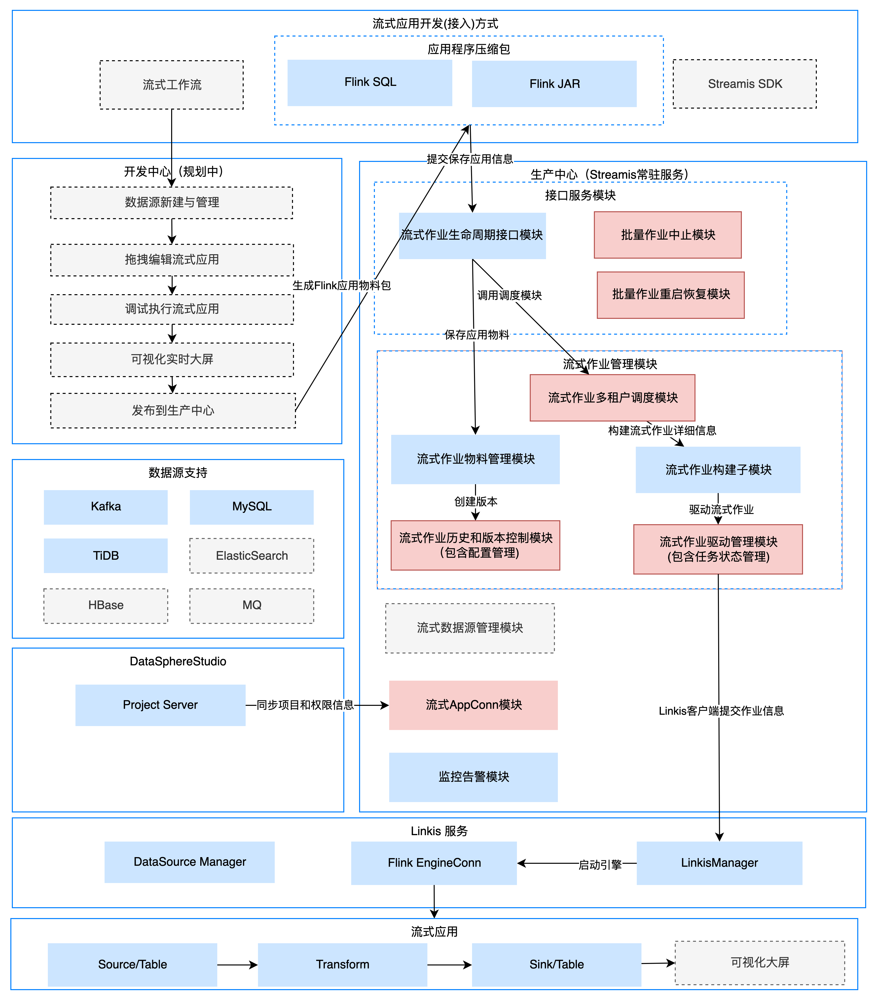

# Streamis

English | [中文](README-ZH.md)
## Introduction

&nbsp; &nbsp; &nbsp; &nbsp;Streamis is an associated joint development application management system jointly established by WeBank Samoyed Financial Services and Xian Weng Technology.

&nbsp; &nbsp; &nbsp; &nbsp;Based on the framework capabilities of [DataSphere Studio](https://github.com/WeBankFinTech/DataSphereStudio) and the underlying docking [Linkis](https://github.com/apache/incubator-linkis/blob/master/README.md) 's **Flink engine** allows users to complete the development, debugging, release and production management of streaming applications at low cost.

&nbsp; &nbsp; &nbsp; &nbsp;In the future, it is also planned to use a workflow-style graphical drag-and-drop development experience, and the streaming application will be based on the Source node,
The Dimension node, Transform node, Sink node and [Visualis](https://github.com/WeBankFinTech/Visualis) nodes are connected in series to form a streaming workflow, allowing users to complete the development of streaming applications at a lower learning cost. Debug and release.

----

## Core features

#### Based on DSS and DSS-Scriptis, to create an industry-leading streaming application development management system.

#### Powerful streaming application development and debugging capabilities, based on DSS-Scriptis, provides streaming application development and debugging functions, and supports real-time debugging and result set display of FlinkSQL.

#### Powerful streaming application production center capabilities. Supports multi-version management, full life cycle management, monitoring alarm, checkpoint and savepoint management capabilities of streaming jobs.

#### Based on Linkis computing middleware, build a financial-level streaming production center with high concurrency, high availability, multi-tenant isolation and resource management and control capabilities.

----

## Comparison With Existing Systems

&nbsp; &nbsp; &nbsp; &nbsp;Streamis is an open source project that leads the direction of streaming application development. There is no similar product in the open source community.

| Function module | describe | Streamis | 
 | :----: | :----: |-------|
| UI | Integrated convenient management interface and monitoring window | Integrated |
| Installation and deployment | Ease of deployment and third-party dependence | One-click deployment, relying on Linkis Flink engine |
| open your heart | Streaming application editing | Support (not open source), integrated DSS | 
|        | Seamlessly connect with DSS and support workflow | Support (not open source) |
|production center | Streaming application management operation and maintenance capabilities | support |
|       | Reuse Linkis computing governance capabilities | support |
|       |Support SQL and jar package release|support |
| High service availability | Multiple services, failure does not affect the use | Application high availability | 
| System Management | Node and resource management | support |
----

## Architecture

----

## Compile and install deployment
Please refer to [Compilation guidelines](docs/en_US/0.1.0/StreamisCompiledDocument.md) used to compile Streamis.

Before installing Streamis, please install Linkis1.0.3 and DSS1.0.2 first, please refer to:：[DSS deployment documents](https://github.com/WeBankFinTech/DataSphereStudio/blob/master/docs/en_US/ch1/DataSphereStudio_Compile_Manual.md) and [Linkis deployment documents](https://github.com/WeBankFinTech/Linkis-Doc/blob/master/en_US/Deployment_Documents/Quick_Deploy_Linkis1.0.md)

At the same time, please make sure that the Linkis Flink engine can be used normally, please refer to:[Linkis Flink Engine Plug-in Installation Document](https://github.com/WeBankFinTech/Linkis-Doc/blob/master/en_US/Deployment_Documents/EngineConnPlugin_installation_document.md)

Finally, please refer to [Streamis Installation and Deployment Document](docs/en_US/0.1.0/StreamisDeployment.md) for installing and deploying Streamis.

----
## Examples and usage guidelines
Please come [User documentation](docs/en_US/userManual/StreamisUserManual.md) ,Learn how to use Streamis quickly.

----
## Communication contribution

----

## License

&nbsp; &nbsp; &nbsp; &nbsp;DSS is under the Apache 2.0 license. See the [License](LICENSE) file for details.

