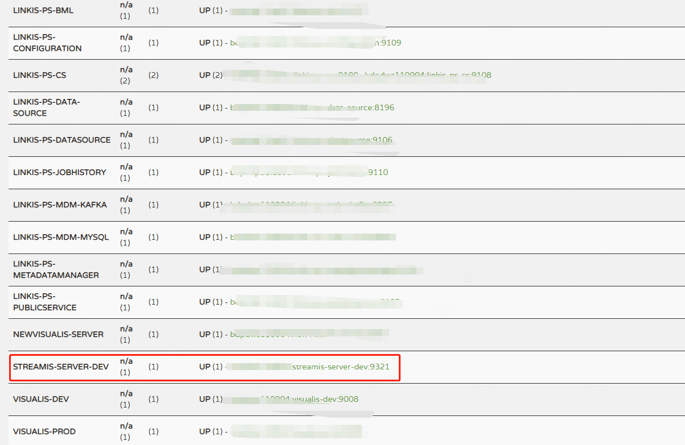

# Streamis installation and deployment documentation

## 1. Component introduction
----------

Streamis0.1.0 provides the Streamis-JobManager component, the role of the component is <br>
1. Publish streaming applications<br>
2. Set streaming application parameters, such as the number of Flink slots, checkpoint related parameters, etc.<br>
3. Manage streaming applications (e.g. start and stop)<br>
4. Streaming application monitoring<br>


## 2. Code compilation
----------
If you have already obtained the installation package, you can skip this step<br>
The background compilation method is as follows
```
cd ${STREAMIS_CODE_HOME}
mvn -N install
mvn clean install
```
The front-end compilation method is as follows
```bash
cd ${STREAMIS_CODE_HOME}/web
npm i
npm run build
```


## 3. Installation preparation
### 3.1 Basic environment installation
&nbsp;&nbsp;&nbsp;&nbsp;&nbsp;&nbsp;&nbsp;&nbsp;The following software must be installed:

-MySQL (5.5+), [How to install MySQL](https://www.runoob.com/mysql/mysql-install.html)
-JDK (above 1.8.0_141), [How to install JDK](https://www.runoob.com/java/java-environment-setup.html)

### 3.2Linkis environment
The execution of Streamis depends on Linkis, and it needs to be version 1.0.3 and above, so you need to install Linkis above 1.0.3 and ensure that the Flink engine can be used normally. Specifically, you can create a new and edit a flinksql script on Scriptis
And execute. If flinksql can be executed correctly, it means that the linkis1.0.3 environment is normal.

### 3.3 Package Preparation
Obtain the software package from the third step and upload it to the installation directory of the server, such as /appcom/Install/streamis
```bash
cd /appcom/Install/streamis
tar -xvf wedatasphere-streamis-${streamis-version}-dist.tar.gz
```

### 3.4 Modify the database configuration
```bash
vi conf/db.sh
#Configure basic database information
```

### 3.5 Modify the basic configuration file

```bash
vi conf/config.sh
#Configure service port information
#Configure Linkis service information
```
## 4. Installation and startup
----------

-Background installation
```bash
sh bin/install.sh
```

-The install.sh script will ask you if you need to initialize the database and import metadata.

&nbsp;&nbsp;&nbsp;&nbsp;&nbsp;Because the user is worried that the user repeatedly executes the install.sh script to clear the user data in the database, when the install.sh is executed, the user will be asked if they need to initialize the database and import metadata.

&nbsp;&nbsp;&nbsp;&nbsp;&nbsp;**Yes must be selected for the first installation**.


- start up
```bash
sh bin/start-streamis.sh
```

-Start verification
Verification method, because Streamis and Linkis use a set of Eureka, you need to check whether the Eureka page of Linkis already contains Streamis services, as shown in the figure,



-Front-end deployment

1. Install nginx
 
```bash
sudo yum install -y nginx
```
2. Deploy the front-end package
```
mkdir ${STREAMIS_FRONT_PATH}
cd ${STREAMIS_FRONT_PATH}
#Place the front-end package
unzip streamis-web.zip
```
3. Modify the nginx configuration file<br>

```bash
cd /etc/nginx/conf.d
vi streamis.conf
# Copy the following template and modify it according to the actual situation
```
```
server {
    listen 9088;# access port
    server_name localhost;
    location / {
        root ${STREAMIS_FRONT_PAH}; # Please modify it to the appropriate static file directory of Streamis
    index index.html index.html;
    }
    location /api {
    proxy_pass http://${Linkis_GATEWAY_IP}:${LINKIS_GATEWY_PORT}; #Back-end Linkis address, please modify it to the ip and port of the Linkis gateway
    proxy_set_header Host $host;
    proxy_set_header X-Real-IP $remote_addr;
    proxy_set_header x_real_ipP $remote_addr;
    proxy_set_header remote_addr $remote_addr;
    proxy_set_header X-Forwarded-For $proxy_add_x_forwarded_for;
    proxy_http_version 1.1;
    proxy_connect_timeout 4s;
    proxy_read_timeout 600s;
    proxy_send_timeout 12s;
    proxy_set_header Upgrade $http_upgrade;
    proxy_set_header Connection upgrade;
    }

    #error_page 404 /404.html;
    # redirect server error pages to the static page /50x.html
    #
    error_page 500 502 503 504 /50x.html;
    location = /50x.html {
    root /usr/share/nginx/html;
    }
}
```
4. Restart nginx
```bash
sudo systemctl restart nginx
```

## 5. Access to DSS
Streamis0.1.0 version access to DSS only implements the first-level specification, that is, you can jump to the Streamis front-end without password on the DSS page. Specifically, you need to configure the basic information of streamis into the DSS database, as follows: You need to replace the ip and port in the first line of sql.
```roomsql
SET @STREAMIS_INSTALL_IP_PORT='127.0.0.1:9088';
SET @URL = replace('http://STREAMIS_IP_PORT','STREAMIS_IP_PORT', @STREAMIS_INSTALL_IP_PORT);
SET @HOMEPAGE_URL = replace('http://STREAMIS_IP_PORT','STREAMIS_IP_PORT', @STREAMIS_INSTALL_IP_PORT);
SET @PROJECT_URL = replace('http://STREAMIS_IP_PORT','STREAMIS_IP_PORT', @STREAMIS_INSTALL_IP_PORT);


delete from `dss_application` WHERE `name` ='STREAMIS';
INSERT INTO `dss_application`(`name`,`url`,`is_user_need_init`,`level`,`user_init_url`,`exists_project_service`,`project_url`,`enhance_json`,`if_iframe`,`homepage_url`,`redirect_url`) VALUES ('STREAMIS', @URL, 0, 1, NULL, 0, @PROJECT_URL,'', 1, @HOMEPAGE_URL, @REDIRECT_URL);

select @dss_STREAMIS_applicationId:=id from `dss_application` WHERE `name` ='STREAMIS';

select @dss_onestop_menu_id:=id from `dss_onestop_menu` where `name` ='Application Development';

delete from `dss_onestop_menu_application` WHERE title_en ='STREAMIS';
INSERT INTO `dss_onestop_menu_application` (`application_id`, `onestop_menu_id`, `title_en`, `title_cn`, `desc_en`, `desc_cn`, `labels_en`, `labels_cn`, `is_active`, `access_button_en`, `access_button_cn`, `manual_button_en`, `manual_button_cn`, `manual_button_url`, `icon`, `order`, `create_by`, `create_time`, `last_update_time`, `last_update_user`, `image`)
VALUES(@dss_STREAMIS_applicationId, @dss_onestop_menu_id,'STREAMIS','Real-time computing platform','Streamis is a streaming application development management system. Based on DataSphereStudio framing capabilities and the underlying docking of Linkis Flink engine, users can complete the development, debugging, release and production management of streaming applications at low cost','Streamis is a streaming application development and management system jointly built by WeBank in cooperation with Tianyi Cloud, Xian Weng Technology and Samoyed Cloud. Based on the framework capabilities of DataSphere Studio, and the underlying docking Linkis The Flink engine allows users to complete the development, debugging, release and production management of streaming applications at low cost.','Streamis','real-time computing platform','1','Enter Streamis','enter Streamis','user manual','User Manual','http://127.0.0.1:8088/wiki/scriptis/manual/workspace_cn.html','shujujiaohuan-logo',NULL,NULL,NULL,NULL,NULL,'shujujiaohuan-icon ');
```
After executing sql, you may need to restart dss-framework-project-server to refresh the memory.