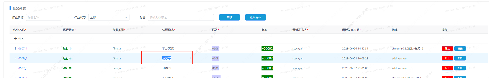
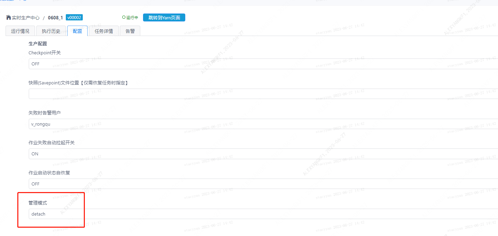
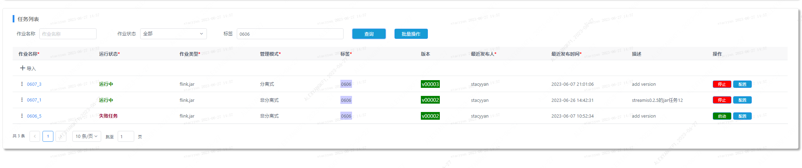
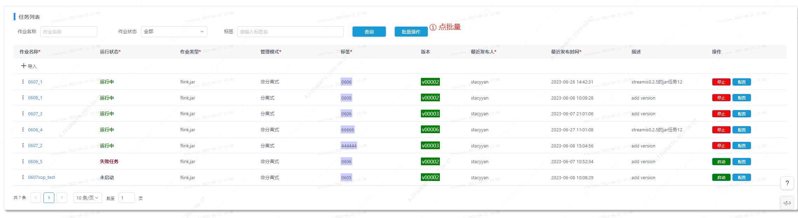
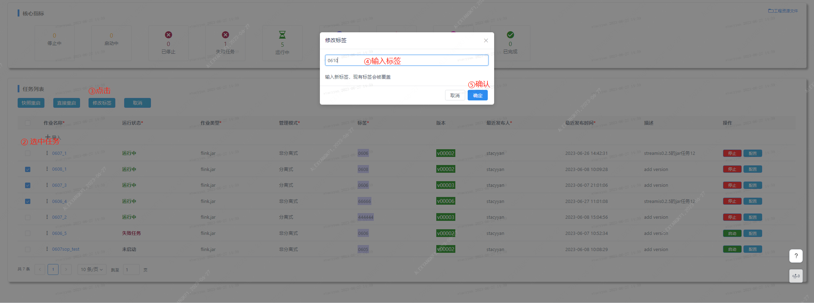
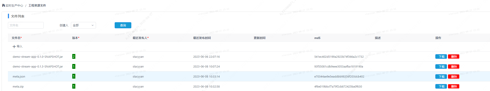
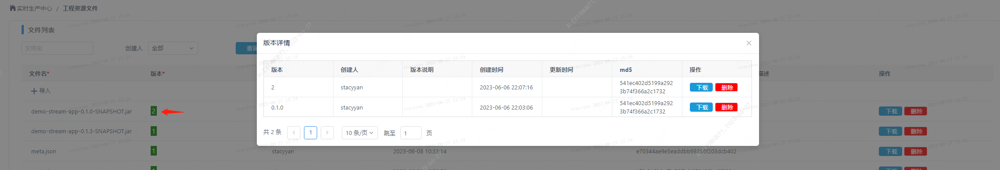
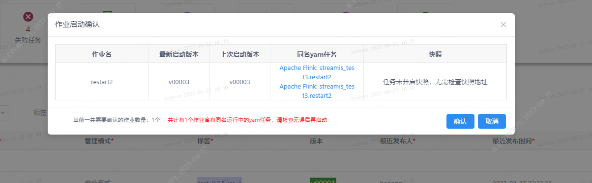

### 1. Separate Feature Refactoring
Version 0.3.0 refactors the features of the separate flink engine and supports separate submissions. After submission, the linkis flink engine will automatically exit and release jvm resources after the yarn flink application is successfully created. streamis continues to manage the lifecycle of flink applications on yarn.


From 0.3.0 onwards, the task is non-separated by default. If you want to change to separated, there are two ways as follows
###### ①When importing production parameters, add the configuration parameter linkis.ec.app.manage.mode , value detach - detached , attach - non-detached (default)
```
"wds.linkis.flink.produce": {
		"wds.linkis.flink.checkpoint.switch":"ON",
		"wds.linkis.flink.alert.failure.user":"alexyang",
		"wds.linkis.flink.app.fail-restart.switch":"OFF",
		"wds.linkis.flink.app.start-auto-restore.switch":"OFF",
		"linkis.ec.app.manage.mode": "detach"
	}
```

###### ②On the task configuration page, change the management mode to detach



### 2. Label filtering
Support for continuing label filtering tasks



###3. Label batch modification

First click batch modification, then select multiple tasks, and click Modify tab. Enter the content of the new label in the pop-up window, supporting uppercase and lowercase letters, numbers, commas, and underscores.





### 4. Upload job zip package to automatically clean up
After importing tasks, the zip cache on the server will be automatically cleared

### 5. 任务启动前检查失败告警人

The failure alerter must be a non-hduser user, otherwise it cannot be started.
You can configure the alerter when importing a task, or on the task configuration interface:
###### ①Import the task, configure the alarm person in the production configuration   wds.linkis.flink.alert.failure.user
```
"wds.linkis.flink.produce": {
		"wds.linkis.flink.checkpoint.switch":"ON",
		"wds.linkis.flink.alert.failure.user":"alexyang",
		"wds.linkis.flink.app.fail-restart.switch":"OFF",
		"wds.linkis.flink.app.start-auto-restore.switch":"OFF",
		"linkis.ec.app.manage.mode": "detach"
	}
```

### 6. Upload project resource file and add md5
On the project resource management page, the uploaded file will have an update time and a corresponding md5 value, and the md5 value is consistent with the result of the linux command line




### 7. When starting a job, it will automatically check the application with the same name on yarn
Click on the application name to jump to the yarn page


