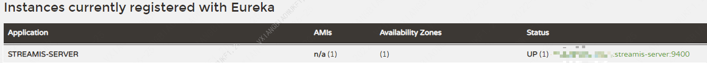

# Streamis安装部署文档

## 1.组件介绍
----------

Streamis0.1.0 提供了 Streamis-JobManager 流式生产中心，其作用主要有：

1. 上传/更新流式应用
2. 配置流式应用参数，如 Flink 的 Slot 数量、checkpoint相关参数等 
3. 管理流式应用，如启停、savepoint等 
4. 流式应用监控告警


## 2.代码编译
----------

**Streamis 无需手动编译，可以直接下载安装包进行部署，请 [点我下载安装包](https://github.com/WeBankFinTech/Streamis/releases)。**

如果您想自己编译 Streamis，可参考如下步骤进行。

后台编译方式如下：

```
cd ${STREAMIS_CODE_HOME}
mvn -N install
mvn clean install
```

前端编译方式如下：

```bash
cd ${STREAMIS_CODE_HOME}/web
npm i
npm run build
```

## 3.安装准备

#### 3.1 基础环境安装

&nbsp;&nbsp;&nbsp;&nbsp;&nbsp;&nbsp;&nbsp;&nbsp;下面的软件必须安装：

- MySQL (5.5+)，[如何安装MySQL](https://www.runoob.com/mysql/mysql-install.html)
- JDK (1.8.0_141以上)，[如何安装JDK](https://www.runoob.com/java/java-environment-setup.html)

### 3.2 Linkis 和 DSS 环境

- Linkis (>=1.0.3)，Streamis 的执行依赖于 Linkis 的 Flink 引擎，并且依赖 **Linkis-1.0.3** 及以上版本。
- DataSphere Studio (>=1.0.1)，Streamis 流式作业的开发和调试，依赖于 DSS-Scriptis，Streamis 流式生产中心则需嵌入到 DSS 工程框架体系之中，所以依赖于 **DSS-1.0.1** 及以上版本。

在正式安装 Streamis 之前，请先安装 Linkis1.0.3 和 DSS1.0.1 及以上版本，并且保证 Linkis Flink 引擎 和 DSS 可以正常使用，DSS 和 Linkis 安装，可参照 [DSS & Linkis 一键安装部署文档](https://github.com/WeBankFinTech/DataSphereStudio-Doc/blob/main/zh_CN/%E5%AE%89%E8%A3%85%E9%83%A8%E7%BD%B2/DSS%E5%8D%95%E6%9C%BA%E9%83%A8%E7%BD%B2%E6%96%87%E6%A1%A3.md)。

如何验证 DSS 和 Linkis 已基本可用？您可以在 DSS-Scriptis 上新建一个 flinksql 脚本并执行，如果 flinksql 能正确执行并返回结果集，表示 DSS 和 linkis 环境是可用的。

### 3.3 安装包准备

将安装包上传到 Linux 服务器（目前只支持 Linux 环境部署）的安装目录，如 /appcom/Install/streamis：

```bash
cd /appcom/Install/streamis
tar -xvf wedatasphere-streamis-${streamis-version}-dist.tar.gz
```

### 3.4 修改数据库配置

```bash
vi conf/db.sh
#配置基础的数据库信息

```

### 3.5 修改基础配置文件

```bash
    vi conf/config.sh
```

```bash

### deploy user
deployUser=hadoop

##The Port of Streamis
STREAMIS_PORT=9400

### The install home path of STREAMIS，Must provided
STREAMIS_INSTALL_HOME=/appcom/Install/streamis

###  Linkis EUREKA  information.  # Microservices Service Registration Discovery Center
EUREKA_INSTALL_IP=127.0.0.1
EUREKA_PORT=20303

### Linkis Gateway  information
GATEWAY_INSTALL_IP=127.0.0.1
GATEWAY_PORT=9001

```

## 4.安装和启动
----------

- 后台安装

```bash
sh bin/install.sh
```

- install.sh脚本会询问您是否需要初始化数据库并导入元数据。

&nbsp;&nbsp;&nbsp;&nbsp;&nbsp;因为担心用户重复执行install.sh脚本，把数据库中的用户数据清空，所以在install.sh执行时，会询问用户是否需要初始化数据库并导入元数据。

&nbsp;&nbsp;&nbsp;&nbsp;&nbsp;**第一次安装**必须选是。


- 启动

```bash
sh bin/start-streamis.sh
```

- 启动验证

验证方式，因为 Streamis 与 Linkis 同用一套 Eureka，所以您需要检查 Linkis 的 Eureka 页面是否已经包含了 Streamis 的服务，如图：




- 前端部署

1.安装nginx
 
```bash
sudo yum install -y nginx
```

2.部署前端包

```
mkdir ${STREAMIS_FRONT_PATH}
cd ${STREAMIS_FRONT_PATH}
#放置前端包
unzip streamis-web.zip
```

3.修改nginx配置文件<br>

```bash
cd /etc/nginx/conf.d
vi streamis.conf
# 复制下面的模板并根据实际情况进行修改
```

```
server {
    listen       9088;# 访问端口
    server_name  localhost;
    location / {
        root   ${STREAMIS_FRONT_PAH}; # 请修改成Streamis恰当南的静态文件目录
    index  index.html index.html;
    }
    location /api {
    proxy_pass http://${Linkis_GATEWAY_IP}:${LINKIS_GATEWY_PORT}; #后端Linkis的地址,请修改成Linkis网关的ip和端口
    proxy_set_header Host $host;
    proxy_set_header X-Real-IP $remote_addr;
    proxy_set_header x_real_ipP $remote_addr;
    proxy_set_header remote_addr $remote_addr;
    proxy_set_header X-Forwarded-For $proxy_add_x_forwarded_for;
    proxy_http_version 1.1;
    proxy_connect_timeout 4s;
    proxy_read_timeout 600s;
    proxy_send_timeout 12s;
    proxy_set_header Upgrade $http_upgrade;
    proxy_set_header Connection upgrade;
    }

    #error_page  404              /404.html;
    # redirect server error pages to the static page /50x.html
    #
    error_page   500 502 503 504  /50x.html;
    location = /50x.html {
    root   /usr/share/nginx/html;
    }
}
```

4.重启nginx

```bash
sudo systemctl restart nginx
```

## 5. 接入DSS

请在 **DSS 数据库**之中，执行以下SQL：

请注意：是在 **DSS 数据库**之中，执行以下SQL！！！

请注意：是在 **DSS 数据库**之中，执行以下SQL！！！

特别需要注意的是：需将以下SQL url 字段的值 ：`http://127.0.0.1:9188/#/realtimeJobCenter?projectName=${projectName}&workspaceName=${workspaceName}` 中的 IP 和 端口，替换为 Streamis 的 IP 和 端口

```roomsql
INSERT INTO `dss_dictionary` ( `workspace_id`, `parent_key`, `dic_name`, `dic_name_en`, `dic_key`, `dic_value`, `dic_value_en`, `title`, `title_en`, `url`, `url_type`,`icon`, `order_num`, `remark`, `create_user`, `create_time`, `update_user`, `update_time`) 
VALUES ('0','p_develop_process','流式生产中心','Streamis Product Center','pdp_streamis_product_center','streamis_prod',NULL,NULL,NULL,
'http://127.0.0.1:9188/#/realtimeJobCenter?projectName=${projectName}&workspaceName=${workspaceName}','0','kaifa-icon','1','工程开发流程-流式生产中心','SYSTEM','2020-12-28 17:32:35',NULL,'2021-02-22 17:49:02');
```

如何验证 DSS 已经成功集成了 Streamis？

请进入 DSS 的工程首页，如果能正常切换到 流式生产中心，则表示 DSS 已经成功集成了 Streamis。如下图：

