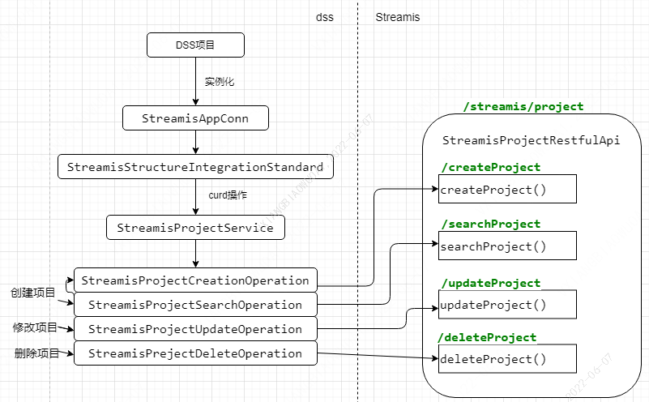
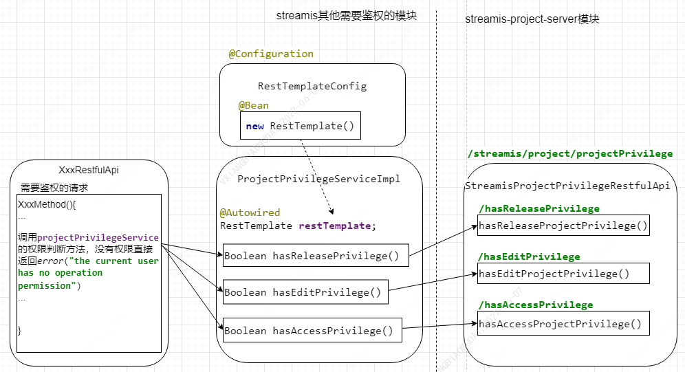

# Streamis接入AppConn

## 总体流程图


## DSS项目appconn插件streamis-appconn

### 配置表
配置下面3张表dss_appconn、dss_workspace_menu_appconn、dss_appconn_instance，appconn_name为realTimeJobCenter是界面访问的appconn，appconn_name为streamis是接口访问的appconn，dss启动时会根据表中配置信息实例化StreamisAppConn对象。下面sql中APPCONN_INSTALL_IP和APPCONN_INSTALL_PORT在执行DSS安装脚本进行自动化安装时会通过交互式命令的方式输入。
```roomsql
select @old_dss_appconn_id:=id from `dss_appconn` where `appconn_name` = 'streamis';

delete from  `dss_workspace_menu_appconn` WHERE `appconn_id` = @old_dss_appconn_id;
delete from `dss_appconn_instance` where `appconn_id` = @old_dss_appconn_id;
delete from  `dss_appconn` where `appconn_name`='streamis';

select @old_jobcenter_dss_appconn_id:=id from `dss_appconn` where `appconn_name` = 'realTimeJobCenter';

delete from  `dss_workspace_menu_appconn` WHERE `appconn_id` = @old_jobcenter_dss_appconn_id;
delete from `dss_appconn_instance` where `appconn_id` = @old_jobcenter_dss_appconn_id;
delete from  `dss_appconn` where `appconn_name`='realTimeJobCenter';

INSERT INTO dss_appconn
(appconn_name, is_user_need_init, `level`, if_iframe, is_external, reference, class_name, appconn_class_path, resource)
VALUES('streamis', 0, 1, 1, 1, NULL, 'com.webank.wedatasphere.streamis.dss.appconn.StreamisAppConn', NULL, NULL);
INSERT INTO dss_appconn
(appconn_name, is_user_need_init, `level`, if_iframe, is_external, reference, class_name, appconn_class_path, resource)
VALUES('realTimeJobCenter', 0, 1, 1, 1, 'sso', '', NULL, NULL);

select @dss_appconn_id:=id from `dss_appconn` where `appconn_name` = 'streamis';
select @jobcenter_dss_appconn_id:=id from `dss_appconn` where `appconn_name` = 'realTimeJobCenter';

INSERT INTO dss_workspace_menu_appconn
(appconn_id, menu_id, title_en, title_cn, desc_en, desc_cn, labels_en, labels_cn, is_active, access_button_en, access_button_cn, manual_button_en, manual_button_cn, manual_button_url, icon, `order`, create_by, create_time, last_update_time, last_update_user, image)
VALUES(@jobcenter_dss_appconn_id, 1, 'StreamSQL development', 'StreamSQL开发', 'Real-time application development is a streaming solution jointly built by WeDataSphere, Boss big data team and China Telecom ctcloud Big data team.', '实时应用开发是微众银行微数域(WeDataSphere)、Boss直聘大数据团队 和 中国电信天翼云大数据团队 社区联合共建的流式解决方案，以 Linkis 做为内核，基于 Flink Engine 构建的批流统一的 Flink SQL，助力实时化转型。',
'streaming, realtime', '流式,实时', 0, 'under union construction', '联合共建中', 'related information', '相关资讯', 'http://127.0.0.1:8088/wiki/scriptis/manual/workspace_cn.html', 'shujukaifa-logo', NULL, NULL, NULL, NULL, NULL, 'shujukaifa-icon');

INSERT INTO dss_appconn_instance
(appconn_id, label, url, enhance_json, homepage_uri)
VALUES(@dss_appconn_id, 'DEV', 'http://APPCONN_INSTALL_IP:APPCONN_INSTALL_PORT/', '', 'http://APPCONN_INSTALL_IP:APPCONN_INSTALL_PORT/#/realTimeJobCenter');

INSERT INTO dss_appconn_instance
(appconn_id, label, url, enhance_json, homepage_uri)
VALUES(@jobcenter_dss_appconn_id, 'DEV', 'http://APPCONN_INSTALL_IP:APPCONN_INSTALL_PORT/#/realTimeJobCenter', NULL, NULL);
```

### 具体实现说明
StreamisAppConn继承AbstractOnlySSOAppConn实现SecondlyAppConn，重写方法创建一个StreamisStructureIntegrationStandard，目前StreamisAppConn只实现了免密登录和组织结构规范功能。

通过重写StreamisStructureIntegrationStandard中方法创建StreamisProjectService，其内部需要重写4个方法，会创建4个操作类StreamisProjectSearchOperation、StreamisProjectCreationOperation、StreamisProjectUpdateOperation、StreamisPrejectDeleteOperation。Operation类通过http调用streamis应用，分别实现查询、创建、修改、删除项目，同步dss项目信息到Streamis。

- dss创建项目时，会先调用查询操作，查询streamis中是否已存在相同的项目名称，如果存在则弹出提示信息，不存在则继续调用创建操作去streamis中新建项目，
- dss修改项目时，会调用修改操作去streamis中更新项目信息，
- dss删除项目时，会调用删除操作去streamis中删除项目信息，更改删除标记。

## 接口
1 接口名称：查询项目
- 接口路径：GET /streamis/project/searchProject
- 请求参数

|参数名称	  |是否必须	|示例	|备注     |
|-------------|---------|-------|--------|
|projectName  |是	|  |  |

- 返回数据

|名称         |类型     |是否必须  |默认值    |备注  |
|-------------|--------|---------|---------|--------|
|method       |string  |否   |
|status       |number  |是   |
|message      |string  |否   |
|data         |object  |是   |
|- projectId  |number  |是   |

2 接口名称：创建项目
- 接口路径：POST /streamis/project/createProject
- 请求参数

|参数名称	  |是否必须	|示例	|备注     |
|-------------|---------|-------|--------|
|projectName  |是	|  |  |
|workspaceId  |否	|  |  |
|releaseUsers  |否	|  |  |
|editUsers    |否	|  |  |
|accessUsers  |否	|  |  |

- 返回数据

|名称      |类型     |是否必须  |默认值    |备注  |
|----------|--------|---------|---------|--------|
|method    |string  |否   |
|status    |number  |是   |
|message   |string  |否   |
|data      |object  |是   |
|- projectId   |number  |是   |
|- projectName  |string  |否   |

3 接口名称：修改项目
- 接口路径：PUT /streamis/project/updateProject
- 请求参数

|参数名称	  |是否必须	|示例	|备注     |
|-------------|---------|-------|--------|
|projectId	  |是	|  |  |
|projectName  |是	|  |  |
|workspaceId  |否	|  |  |
|releaseUsers  |否	|  |  |
|editUsers    |否	|  |  |
|accessUsers  |否	|  |  |

- 返回数据

|名称      |类型     |是否必须  |默认值    |备注  |
|----------|--------|---------|---------|--------|
|method    |string  |否   |
|status    |number  |是   |
|message   |string  |否   |
|data      |object  |否   |

4 接口名称：删除项目
- 接口路径：DELETE /streamis/project/deleteProject
- 请求参数

|参数名称	  |是否必须	|示例	|备注     |
|-------------|---------|-------|--------|
|projectId	  |是	|  |  |
|projectName  |否	|  |  |

- 返回数据

|名称      |类型     |是否必须  |默认值    |备注  |
|----------|--------|---------|---------|--------|
|method    |string  |否   |
|status    |number  |是   |
|message   |string  |否   |
|data      |object  |否   |

## Streamis项目streamis-project-server

### 相关表操作
Streamis涉及到的表共2张,项目表linkis_stream_project和项目权限表linkis_stream_project_privilege。
```roomsql
--已存在表
CREATE TABLE `linkis_stream_project` (
  `id` bigint(20) NOT NULL AUTO_INCREMENT,
  `workspace_id` bigint(20) DEFAULT NULL,
  `name` varchar(100) DEFAULT NULL,
  `create_by` varchar(50) DEFAULT NULL,
  PRIMARY KEY (`id`) USING BTREE
) ENGINE=InnoDB AUTO_INCREMENT=1 DEFAULT CHARSET=utf8 ROW_FORMAT=COMPACT COMMENT='项目表';

--新增加表
CREATE TABLE `linkis_stream_project_privilege` (
  `id` bigint(20) NOT NULL AUTO_INCREMENT,
  `project_id` bigint(20) NOT NULL,
  `user_name` varchar(100) NOT NULL,
  `privilege` tinyint(1) DEFAULT '0' NOT NULL COMMENT '1:发布权限 ，2:编辑权限 ，3:查看权限',
  PRIMARY KEY (`id`) USING BTREE
) ENGINE=InnoDB AUTO_INCREMENT=1 DEFAULT CHARSET=utf8 COMMENT='项目权限表';

--新增加字段
ALTER TABLE `linkis_stream_project` ADD create_time datetime DEFAULT NULL;
ALTER TABLE `linkis_stream_project` ADD last_update_by varchar(50) DEFAULT NULL;
ALTER TABLE `linkis_stream_project` ADD last_update_time datetime DEFAULT NULL;
ALTER TABLE `linkis_stream_project` ADD is_deleted tinyint unsigned DEFAULT 0;
```

### 具体实现说明
- 查询操作，会获取请求参数projectName，在表linkis_stream_project中查询对应id，查询操作成功返回status为0，projectId为查询出来的id，如果查询结果为空则projectId为null；
- 创建操作，会将请求参数中项目信息（projectName、workspaceId）插入项目表linkis_stream_project并自增生成id，将请求参数中权限信息数据（releaseUsers、editUsers、accessUsers）中user和项目表生成id关联，插入表linkis_stream_project_privilege，创建操作成功返回status值为0，会将项目表生成id作为projectId的值返回；
- 修改操作，会根据请求参数projectId将请求信息数据更新到表linkis_stream_project和 linkis_stream_project_privilege，成功直接返回status值为0；
- 删除操作，会根据projectId将表linkis_stream_project的is_deleted字段标记为1，linkis_stream_project_privilege中相关数据删除，成功直接返回status值为0。

# 鉴权

## 鉴权流程图


### edit权限接口：

|RequestMethod  |接口路径                                          |名称             |
|------|----------------------------------------------------------|-----------------|
|POST  |/streamis/streamProjectManager/project/files/upload       |工程资源文件-导入   |
|GET   |/streamis/streamProjectManager/project/files/delete       |删除项目下该文件所有版本  |
|GET   |/streamis/streamProjectManager/project/files/version/delete |删除版本文件  |
|GET   |/streamis/streamProjectManager/project/files/download     |任务详情-下载  |
|POST  |/streamis/streamJobManager/job/upload                     |上传文件  |
|POST  |/streamis/streamJobManager/job/execute                  |启动  |
|GET   |/streamis/streamJobManager/job/stop                     |停止  |
|PUT   |/streamis/streamJobManager/job//snapshot/{jobId:\w+}    |快照生成  |
|GET   |/streamis/streamJobManager/config/json/{jobId:\w+}    |配置-保存  |
|POST  |/streamis/streamJobManager/job/bulk/execution         |批量启动  |
|POST  |/streamis/streamJobManager/job/bulk/pause             |批量停止  |


### access权限接口：

|RequestMethod  |接口路径                                          |名称          |
|------|----------------------------------------------------------|-------------|
|GET   |streamis/streamJobManager/job/list                        |查询当前用户可查看job  |
|GET   |/streamis/streamProjectManager/project/files/list         |工程资源文件  |
|GET   |/streamis/streamProjectManager/project/files/version/list  |获取工程下该文件所有版本  |
|GET   |/streamis/streamJobManager/job/version                    |查询job版本  |
|GET   |/streamis/streamJobManager/job/execute/history            |job执行历史  |
|GET   |/streamis/streamJobManager/job/progress                |获取job当前版本最新task状态  |
|GET   |/streamis/streamJobManager/job/jobContent             |任务详情  |
|GET   |/streamis/streamJobManager/job/logs                   |获取日志  |
|POST  |/streamis/streamJobManager/config/json/{jobId:\w+}    |获得任务配置  |
|GET   |/streamis/streamJobManager/config/view                |查询当前job配置信息  |