# Streamis快速入门

## 1. 前言

&nbsp;&nbsp;&nbsp;&nbsp;&nbsp;&nbsp;&nbsp;&nbsp;&nbsp;本文是Streamis0.1.0的快速入门文档，涵盖了Stremis的基本使用流程，更多的操作使用细节，将会在用户使用文档中提供。  


## 2. Streamis整合至DSS

&nbsp;&nbsp;&nbsp;&nbsp;&nbsp;&nbsp;&nbsp;&nbsp;&nbsp;为了方便用户使用，**Streamis系统以DSS组件的形式嵌入DSS系统中**

##### 		2.1 **如何接入？**

​		在**DSS数据库**中执行以下SQL：

​		**特别注意：**

​		需要将以下SQL中URL字段的值：http://127.0.0.1:9188/#/realtimeJobCenter?projectName=${projectName}&workspaceName=${workspaceName}

中的IP（127.0.0.1）和端口（9188）替换成您部署的streamis的IP与端口，其他内容无需改动

```
INSERT INTO `dss_dictionary` ( `workspace_id`, `parent_key`, `dic_name`, `dic_name_en`, `dic_key`, `dic_value`, `dic_value_en`, `title`, `title_en`, `url`, `url_type`,`icon`, `order_num`, `remark`, `create_user`, `create_time`, `update_user`, `update_time`) 
VALUES ('0','p_develop_process','流式生产中心','Streamis Product Center','pdp_streamis_product_center','streamis_prod',NULL,NULL,NULL,
'http://127.0.0.1:9188/#/realtimeJobCenter?projectName=${projectName}&workspaceName=${workspaceName}','0','kaifa-icon','1','工程开发流程-流式生产中心','SYSTEM','2020-12-28 17:32:35',NULL,'2021-12-30 17:49:02');
```

#####       2.2 如何验证 DSS 已经成功集成了 Streamis？

​		请进入 DSS 的工程首页，创建一个工程

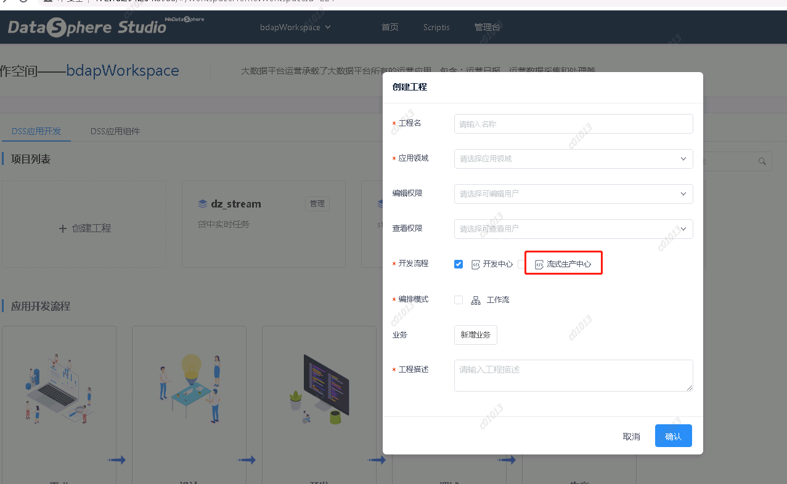

进入到工程里面，点击右上角"开发中心"按钮切换到”流式生产中心“

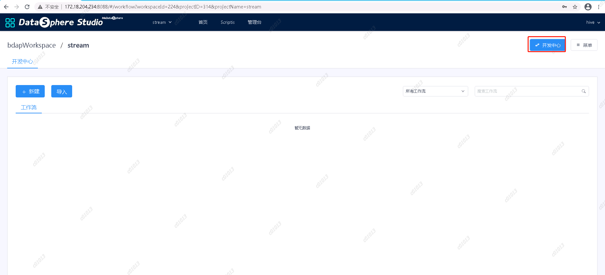

如果出现streamis的首页，则表示则表示 DSS 已经成功集成了 Streamis。如下图：

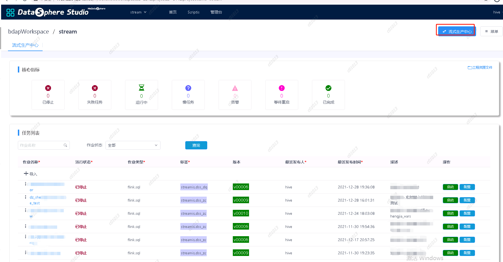


## 3. 核心指标 

&nbsp;&nbsp;&nbsp;&nbsp;&nbsp;&nbsp;&nbsp;&nbsp;&nbsp;进入到首页，上半部显示的是核心指标。

&nbsp;&nbsp;&nbsp;&nbsp;&nbsp;&nbsp;&nbsp;&nbsp;&nbsp;核心指标显示上传到该项目执行的Flink任务的状态汇总，状态暂时有7种，显示状态名称和处于该状态的任务数量，具体内容如下图。


<center>图 3.1 首页核心指标</center>

# 4. 任务示例

&nbsp;&nbsp;&nbsp;&nbsp;&nbsp;&nbsp;&nbsp;主要演示案例从Script FlinkSQL开发，调试到Streamis发布的整个流程。

## 4.1. Script开发SQL

&nbsp;&nbsp;&nbsp;&nbsp;&nbsp;&nbsp;&nbsp;创建一个脚本文件，脚本类型选择Flink,如下图所示：

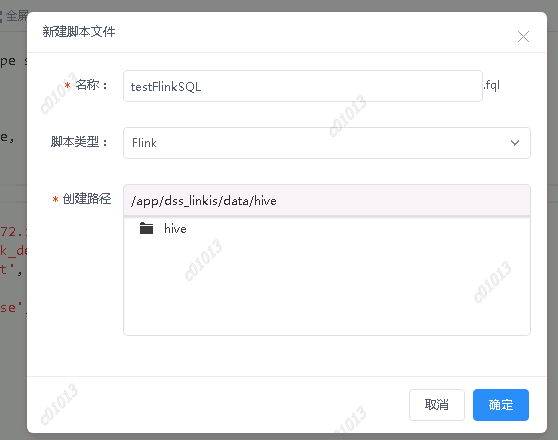

编写FlinkSQL，source,sink,transform等。

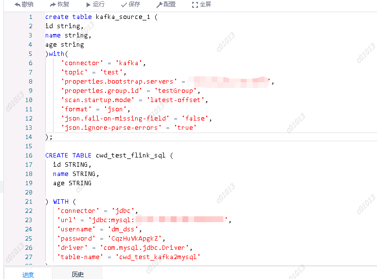

点击运行后，即可调试该脚本，点击任务管理器可看到当前运行的引擎

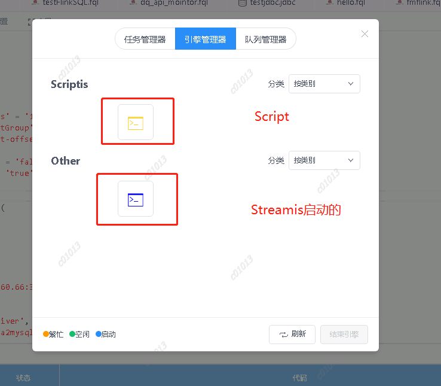

## 4.2. 发布至Streamis

### 		4.2.1 打包Streamis Job任务

​				流式应用物料包是指的按照Streamis打包规范，将元数据信息(流式应用描述信息),流式应用代码，流式应用使用到的物料等内容打包成zip包。zip具体格式如下：

	xxx.zip
	    ├── meta.json
	    ├── test.sql
	    ├── test.jar
	    ├── file3

其中，meta.json是StreamisJob的元数据信息，其格式为：

```
{
	"projectName": "",  # 项目名
	"jobName": "",   # 作业名
	"jobType": "flink.sql",		# 目前只支持flink.sql、flink.jar
	"tags": "",   # 应用标签
	"description": ""    # 作业描述,
	"jobContent": {
		# 不同的jobType，其内容各不相同，具体请往下看
	}
}
```

！！！！！**特别需要注意的是：**

​	**此处的projectName需要和您dss工程中创建的工程名一致，不然在streamis页面导入ZIP包时，刷新列表后会不会显示，因为两者的projectName不一致**

如果jobType为"flink.sql"，则jobContent为：

```
{
	"type": ""  # file, bml or sql
	"sql": "select 1",
	"file": "test.sql",
	"resourceId": "",
	"version": ""
}
其中，如果type为"file"，则只识别file字段；如果type为"sql"，则只识别sql字段；如果type为"bml"，则只识别resourceId和version字段。
```

如果jobType为"flink.jar"，则jobContent为：

```
{
	"main.class.jar": "",   # string。main class的jar，如：test.jar
	"main.class": "",		# main class，如 com.webank.Test
	"args": "",				# main class 的入参，即main函数的args，请以空格为分隔符
	"hdfs.jars"； [],   	# 依赖的HDFS jars，如：hdfs:///user/hadoop/test1.jar
	"dependency.jars": [],	# 依赖的jars，如：test2.jar
	"resources": []			# 依赖的资源文件，如：test.properties
}
```

### 4.2.2 示例

​	dzshengjiavars为flinksql文件，meta.json是该任务的元数据信息。

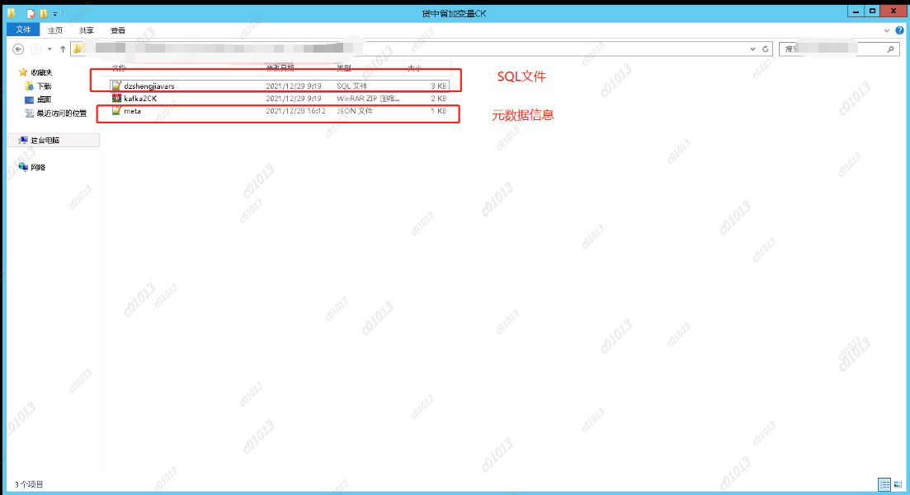

<br/>

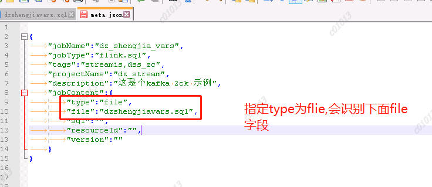

将SQL文件和meta.json文件打包成一个zip文件，注意：只能打包成zip文件，其他格式如rar、7z等格式无法识别。

在streamis中将该zip包导入，导入任务后，任务的运行状态变成"未启动",版本会+1（导入新的job任务版本从1开始），最新发布时间会更新至最新时间。

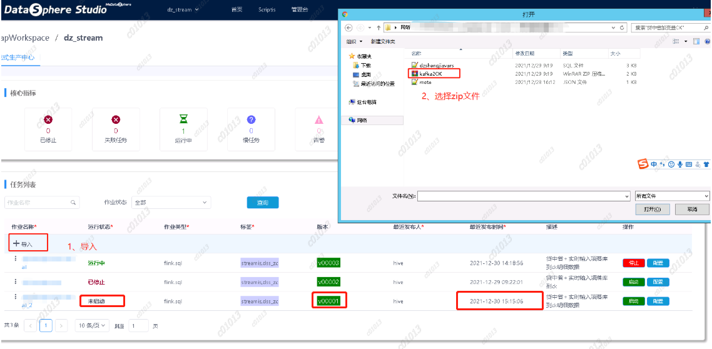

#### 


# 5、Streamis任务介绍

点击”作业名称“,可查看任务的详情，包括，运行情况、执行历史、配置、任务详情、告警等。

## 5.1 运行情况

​	实时数据展示待二期开发。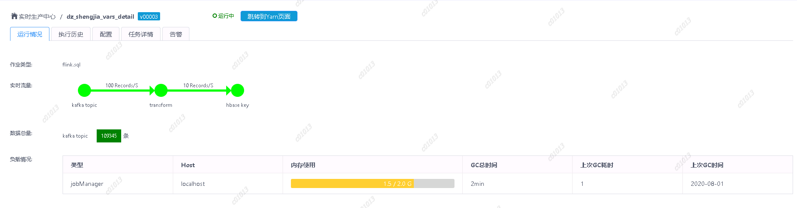

## 5.2 执行历史

打开执行历史可以查看该任务的历史运行情况，

历史日志：只有正在运行的任务才能查看历史日志。

历史日志中可以查看当前任务启动的flink引擎的日志，可以根据关键字等查看关键日志，点击查看最新日志，可以查看当前引擎的最新日志。


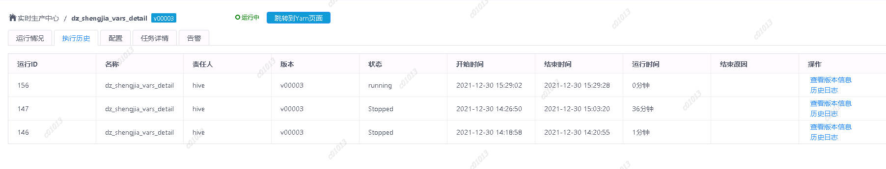

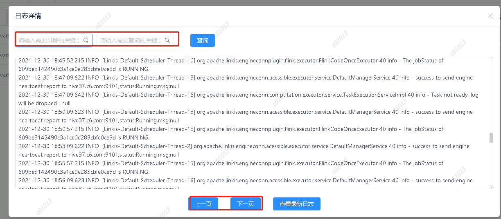

## 5.3 配置

给Streamis任务配置一些flink资源参数以及checkpoint的参数


## 5.4任务详情

<br/>

&nbsp;&nbsp;任务详情根据任务类型Flink Jar 和 Flink SQL分为两种显示界面。

<br/>

**Flink Jar任务详情**


<center>Flink Jar任务详情</center> 

<br/>

&nbsp;&nbsp;Flink Jar任务详情展示了任务Jar包的内容和参数， 同时提供下载该Jar包的功能。

<br/>

**Flink SQL任务详情**

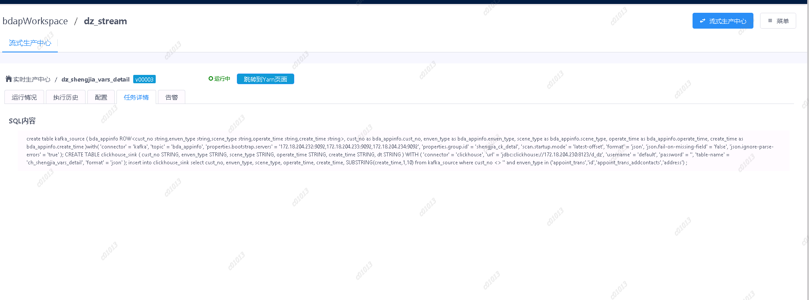

<center>Flink SQL任务详情</center> 

<br/>

&nbsp;&nbsp;Flink SQL任务详情展示了该任务的SQL语句。

<br/>

## 5.5 进入Yarn页面

正在运行的Streamis任务可以通过该按钮进入到yarn管理界面上的查看flink任务运行情况。


