# Streamis快速入门

## 1. 前言

&nbsp;&nbsp;&nbsp;&nbsp;&nbsp;&nbsp;&nbsp;&nbsp;&nbsp;本文是Streamis0.1.0的快速入门文档，涵盖了Stremis的基本使用流程，更多的操作使用细节，将会在用户使用文档中提供。  
  

## 2. Streamis入口
&nbsp;&nbsp;&nbsp;&nbsp;&nbsp;&nbsp;&nbsp;&nbsp;&nbsp;为了方便用户使用，**Streamis系统以DSS组件的形式嵌入DSS系统中**

入口路径为 **首页-DSS组件应用-进入Streamis**

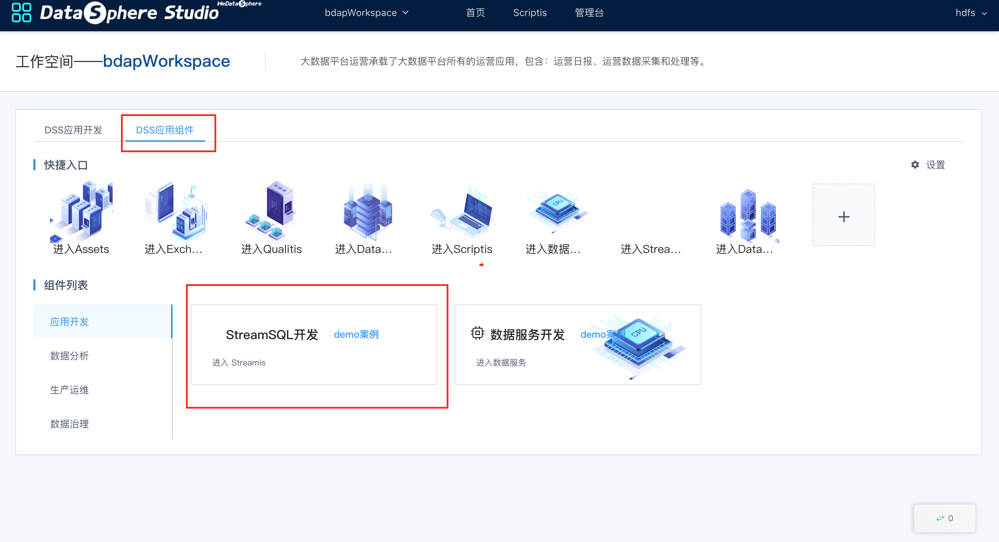
<center>图 2.1 Streamis在DSS中的入口</center>

## 3. 核心指标 

&nbsp;&nbsp;&nbsp;&nbsp;&nbsp;&nbsp;&nbsp;&nbsp;&nbsp;进入到首页，上半部显示的是核心指标。

&nbsp;&nbsp;&nbsp;&nbsp;&nbsp;&nbsp;&nbsp;&nbsp;&nbsp;核心指标显示上传到该项目执行的Flink任务的状态汇总，状态暂时有7种，显示状态名称和处于该状态的任务数量，具体内容如下图。

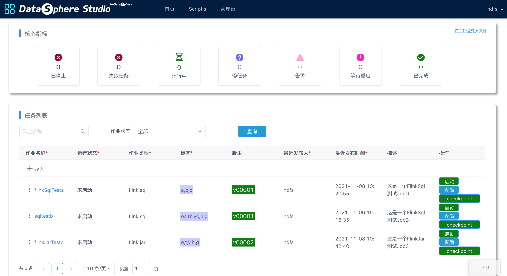
<center>图 3.1 首页核心指标</center>

# 4. 任务管理

&nbsp;&nbsp;&nbsp;&nbsp;&nbsp;&nbsp;&nbsp;&nbsp;&nbsp;支持发布Flink Jar 和 Flink SQL ，提供流式应用的开发调试和生产管理能力，如：启停、状态监控、checkpoint等。

## 4.1. 上传任务

&nbsp;&nbsp;&nbsp;&nbsp;&nbsp;&nbsp;&nbsp;&nbsp;&nbsp;点击 **“上传”** ，选择要上传的zip文件, 文件分为Flink Jar 和 Flink SQL两种任务类型, 格式如下：

### 4.1.1. Flink Jar ZIP文件内容如下：

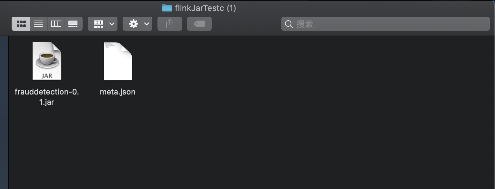
<center>图4.1 Flink Jar ZIP文件内容</center> 

<br/>

#### Flink Jar meta.json内容：

```json
{
    "projectName": "flinkJarTest3",
    "jobName": "flinkJarTestc",
    "jobType": "flink.jar",
    "tags": "e,t,y,h,g",
    "description": "这是一个FlinkJar测试Job3",
    "jobContent": {
        "main.class.jar": "frauddetection-0.1.jar",
        "main.class": "spendreport.FraudDetectionJob",
        "args": ["aa","bb"],
        "hdfs.jars": [],
        "dependency.jars": [],
        "resources": []
    }
}
```

### 4.1.2. Flink SQL ZIP文件

&nbsp;&nbsp;&nbsp;&nbsp;&nbsp;&nbsp;&nbsp;&nbsp;&nbsp;SQL类型文件只是一个meta.json文件的ZIP压缩包，其内容如下：

#### Flink SQL meta.json内容：

```json
{
  "projectName": "flinkSqlTestD",
  "jobName": "flinkSqlTesta",
  "jobType": "flink.sql",
  "tags": "a,b,c",
  "description": "这是一个FlinkSql测试JobD",
  "jobContent": {
    "type": "sql",
    "sql": "select 1",
    "file": "",
    "resourceId": "",
    "version": ""
  }
}

```

<br/>

&nbsp;&nbsp;&nbsp;&nbsp;&nbsp;&nbsp;&nbsp;&nbsp;&nbsp;ZIP文件上传成功后，该任务显示在图3.1的任务列表中，根据任务状态提供 启动、停止、配置和checkpoint等操作；

&nbsp;&nbsp;&nbsp;&nbsp;&nbsp;&nbsp;&nbsp;&nbsp;&nbsp;任务列表提供 **“查询”** 功能，其中 **作业名称** 提供模糊查询的功能。


## 4.2. 任务详情

<br/>

&nbsp;&nbsp;&nbsp;&nbsp;&nbsp;&nbsp;&nbsp;&nbsp;&nbsp;点击任务列表中某一任务的 **“版本”** 提供查看该任务所有版本的功能，如下图：

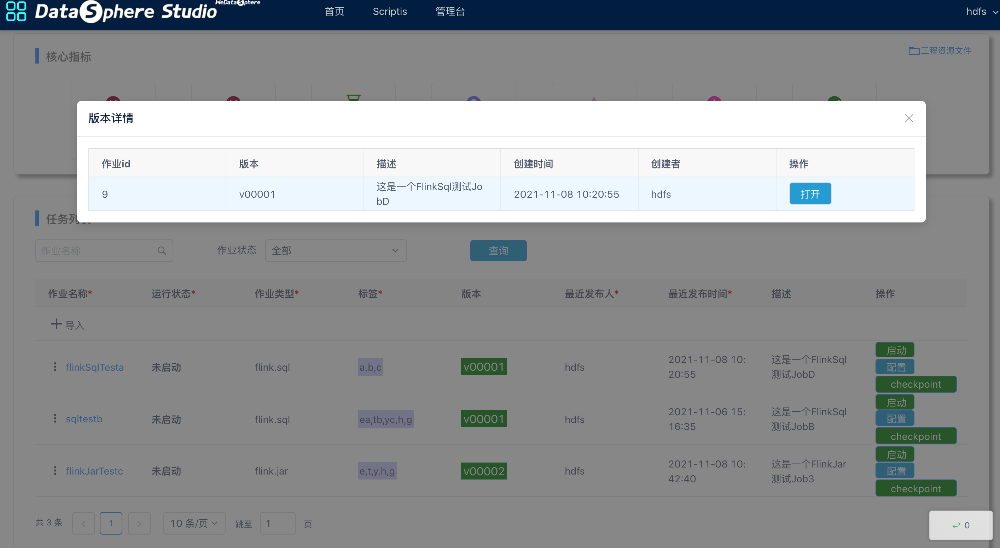
<center>图4.2 版本详情</center> 

<br/>

&nbsp;&nbsp;&nbsp;&nbsp;&nbsp;&nbsp;&nbsp;&nbsp;&nbsp;点击任务列表中某一版本的“打开”提供查看该版本的 **“执行历史”** 和 **“任务详情”**，如下图：

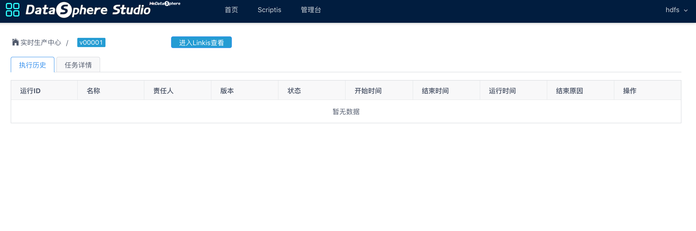
<center>图4.3 版本详情</center> 
<br/>

&nbsp;&nbsp;&nbsp;&nbsp;&nbsp;&nbsp;&nbsp;&nbsp;&nbsp;点击上图中 **“实时生产中心”** 可以返回Streamis首页。

## 4.3. 管理任务

<br/>

&nbsp;&nbsp;&nbsp;&nbsp;&nbsp;&nbsp;&nbsp;&nbsp;&nbsp;点击任务列表中某一任务的 **“作业名称”** 提供管理该任务的功能，或者点击名称左侧 **“三点符号”** 调出具体功能配置入口，如下图：

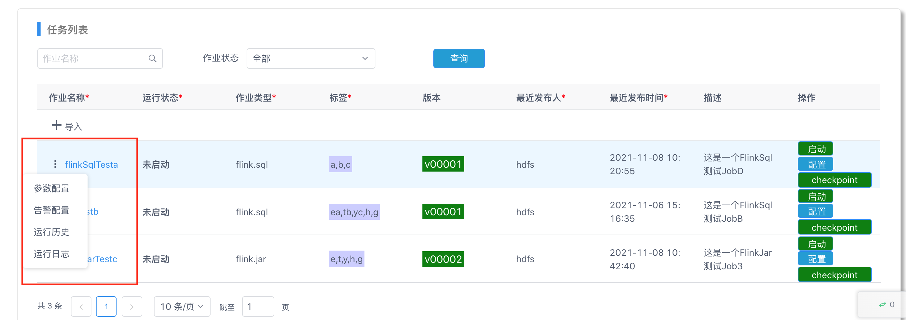
<center>图4.3 配置任务</center> 

<br/>

&nbsp;&nbsp; 配置任务提供四个功能，分别为：

- 运行情况
- 执行历史
- 配置
- 任务详情

<br/>

### 4.3.1. 运行情况：

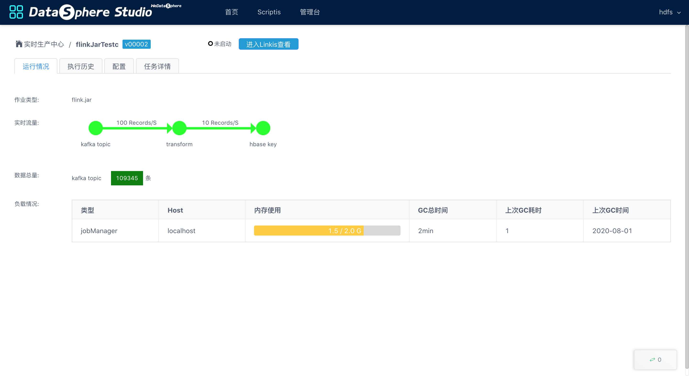
<center>图4.4 运行情况</center> 

<br/>

&nbsp;&nbsp;运行情况汇总该任务的实时流量、数据总量和负载情况等。

<br/>

### 4.3.2. 运行历史：


<center>图4.5 运行历史</center> 

<br/>

&nbsp;&nbsp;运行历史记录了该任务每次运行的记录。

<br/>


### 4.3.3. 配置：

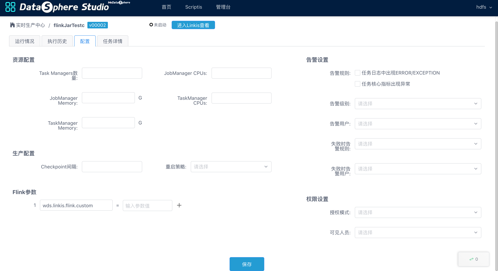
<center>图4.6 配置</center> 

<br/>

&nbsp;&nbsp;配置页面用于配置运行任务的各个参数，提供了以下几个类型的配置：

- 资源配置
- 生产配置
- Flink参数
- 告警设置
- 权限设置

<br/>

### 4.3.4. 任务详情：

<br/>

&nbsp;&nbsp;任务详情根据任务类型Flink Jar 和 Flink SQL分为两种显示界面。

<br/>

**Flink Jar任务详情**

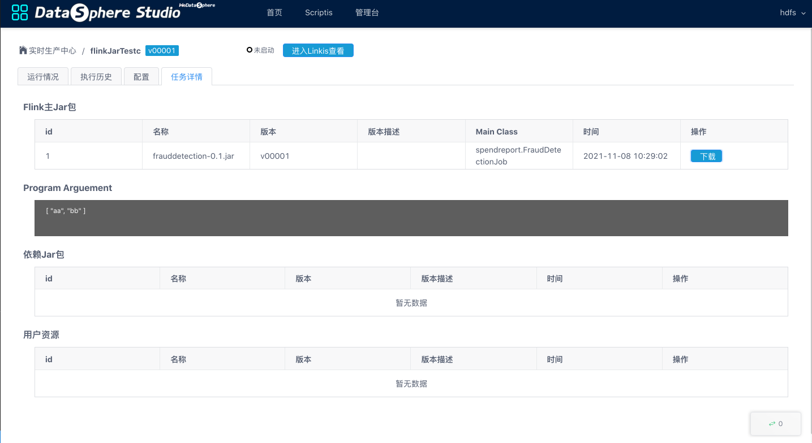
<center>Flink Jar任务详情</center> 

<br/>

&nbsp;&nbsp;Flink Jar任务详情展示了任务Jar包的内容和参数， 同时提供下载该Jar包的功能。

<br/>


**Flink SQL任务详情**

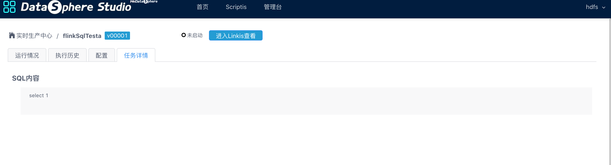
<center>Flink SQL任务详情</center> 

<br/>

&nbsp;&nbsp;Flink SQL任务详情展示了该任务的SQL语句。

<br/>


## 5. 工程资源文件 

<br/>

&nbsp;&nbsp;&nbsp;&nbsp;&nbsp;&nbsp;&nbsp;&nbsp;&nbsp; **页面入口：** 在首页-核心指标右上部 **“工程资源文件”**。

&nbsp;&nbsp;&nbsp;&nbsp;&nbsp;&nbsp;&nbsp;&nbsp;&nbsp;工程资源文件提供了上传和管理该工程所需资源文件的功能，如下图：

<br/>

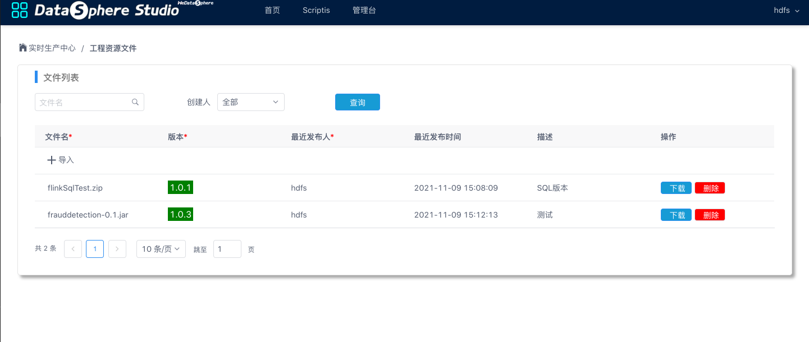
<center>图 5.1 工程文件首页</center>

<br/>

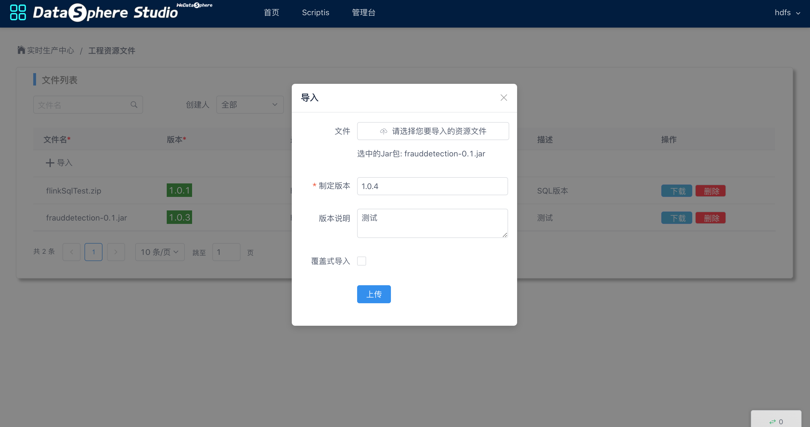
<center>图 5.2 上传工程文件</center>
