# Streamis快速入门

## 1. 前言

&nbsp;&nbsp;&nbsp;&nbsp;&nbsp;&nbsp;&nbsp;&nbsp;&nbsp;本文是Streamis0.2.5的快速入门文档，涵盖了Stremis的基本使用流程，更多的操作使用细节，将会在用户使用文档中提供。  


## 2. Streamis整合至DSS

为了方便用户使用，**Streamis系统以DSS组件的形式嵌入DSS系统中**

##### 		2.1 **如何接入？**

按照 [StreamisAppConn安装文档](../development/StreamisAppConn安装文档.md) 安装部署StreamisAppConn成功后，Streamis系统会自动嵌入DSS系统中。

#####       2.2 如何验证 DSS 已经成功集成了 Streamis？

请进入 DSS 的工程首页，创建一个工程

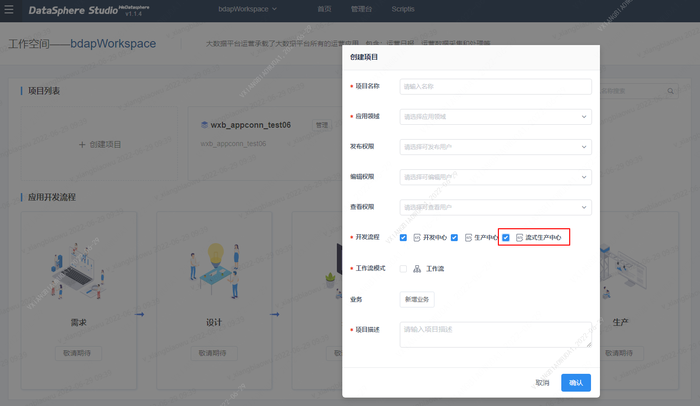

进入到工程里面，点击左上角按钮切换到”流式生产中心“，如果出现streamis的首页，则表示 DSS 已经成功集成了 Streamis。如下图：

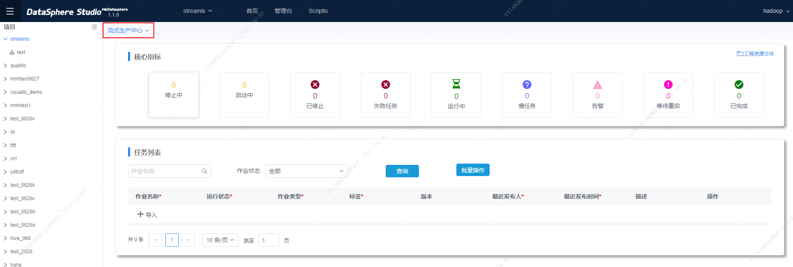


## 3. 核心指标 

进入到streamis首页，上半部显示的是核心指标。

核心指标显示当前用户可查看到的上传到该项目执行的Flink任务的状态汇总，状态暂时有9种，显示状态名称和处于该状态的任务数量，具体内容如下图。

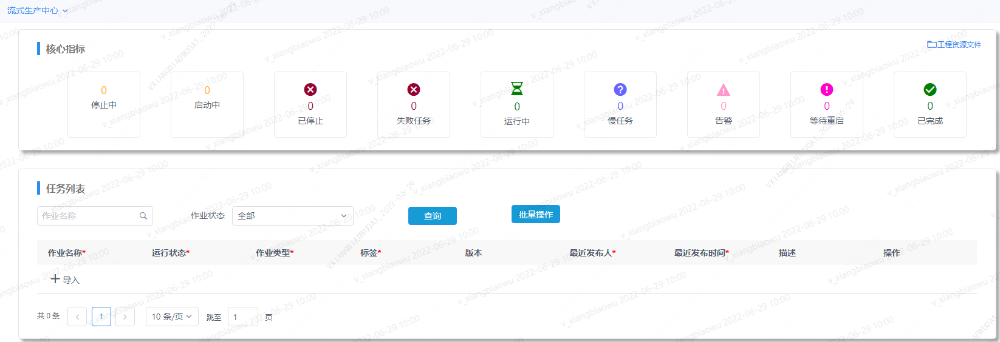

<center>图 3.1 首页核心指标</center>
## 4. 任务示例

&nbsp;&nbsp;&nbsp;&nbsp;&nbsp;&nbsp;&nbsp;主要演示案例从Script FlinkSQL开发，调试到Streamis发布的整个流程。

### 4.1. Script开发SQL

&nbsp;&nbsp;&nbsp;&nbsp;&nbsp;&nbsp;&nbsp;顶部Scriptis菜单创建一个脚本文件，脚本类型选择Flink,如下图所示：

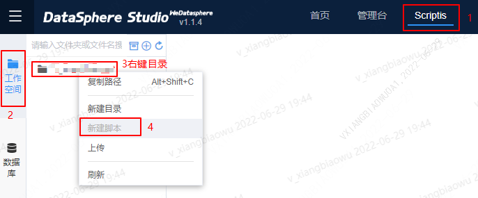

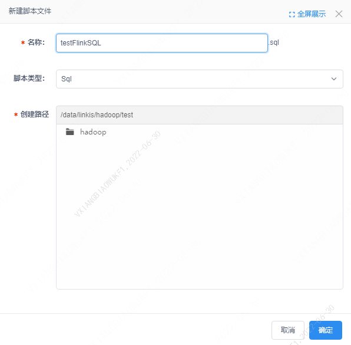

编写FlinkSQL，source,sink,transform等。


点击运行后，即可调试该脚本

### 4.2. 发布至Streamis

#### 		4.2.1 打包Streamis Job任务

​				流式应用物料包是指的按照Streamis打包规范，将元数据信息(流式应用描述信息),流式应用代码，流式应用使用到的物料等内容打包成zip包。zip具体格式如下：

	xxx.zip
	    ├── meta.json
	    ├── test.sql
	    ├── test.jar
	    ├── file3

其中，meta.json是StreamisJob的元数据信息，其格式为：

```
{
	"projectName": "",  # 项目名
	"jobName": "",   # 作业名
	"jobType": "flink.sql",		# 目前只支持flink.sql、flink.jar
	"tags": "",   # 应用标签
	"description": ""    # 作业描述,
	"jobContent": {
		# 不同的jobType，其内容各不相同，具体请往下看
	},
	"jobConfig": {
        "wds.linkis.flink.resource": {
    		"wds.linkis.flink.app.parallelism":"",  # Parallelism并行度
    		"wds.linkis.flink.jobmanager.memory":"",  # JobManager Memory(M)
    		"wds.linkis.flink.taskmanager.memory":"", # TaskManager Memory(M)
    		"wds.linkis.flink.taskmanager.numberOfTaskSlots":"",  # TaskManager Slot数量
    		"wds.linkis.flink.taskmanager.cpus":"",  # TaskManager CPUs
    		"wds.linkis.rm.yarnqueue":""  # Yarn队列
    		"flink.client.memory":""  # 客户端内存
    	},
    	"wds.linkis.flink.custom": {
            # Flink作业相关参数
    	},
    	"wds.linkis.flink.produce": {
    	    "wds.linkis.flink.checkpoint.switch":"OFF",  # Checkpoint开关
    		"wds.linkis.flink.app.fail-restart.switch":"OFF",  # 作业失败自动拉起开关
    		"wds.linkis.flink.app.start-auto-restore.switch":"OFF"  # 作业启动状态自恢复
    	}
    }
}
```

其中，jobConfig的配置项可以不填，有默认的配置项，具体如下：

```yaml
"jobConfig": {
        "wds.linkis.flink.resource": {
    		"wds.linkis.flink.app.parallelism":"4",
    		"wds.linkis.flink.jobmanager.memory":"2048",
    		"wds.linkis.flink.taskmanager.memory":"4096",
    		"wds.linkis.flink.taskmanager.numberOfTaskSlots":"2",
    		"wds.linkis.flink.taskmanager.cpus":"2"
    	},
    	"wds.linkis.flink.custom": {
            "stream.log.filter.keywords":"ERROR,WARN,INFO",
            "security.kerberos.krb5-conf.path":"/appcom/Install/streamis/krb5.conf",
            "demo.log.tps.rate":"20000",
             "classloader.resolve-order":"parent-first",
             "stream.log.debug":"true",
             "security.kerberos.login.contexts":"KafkaClient,Client",
             "security.kerberos.login.keytab":"/appcom/Install/streamis/hadoop.keytab",
             "security.kerberos.login.principal":"hadoop/inddev010004@WEBANK.COM"
    	},
    	"wds.linkis.flink.produce": {
    	    "wds.linkis.flink.checkpoint.switch":"OFF",
    		"wds.linkis.flink.app.fail-restart.switch":"OFF",
    		"wds.linkis.flink.app.start-auto-restore.switch":"OFF"
    	}
    }
```

 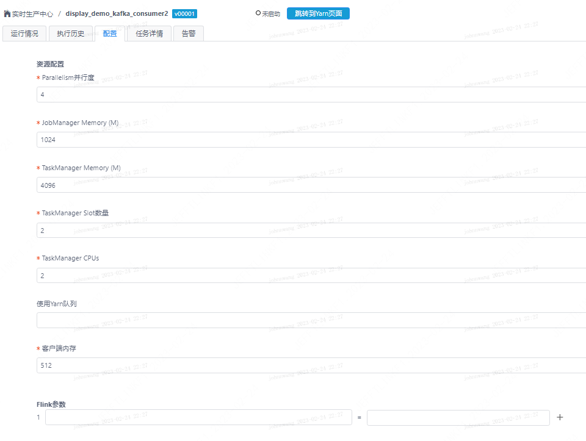 

 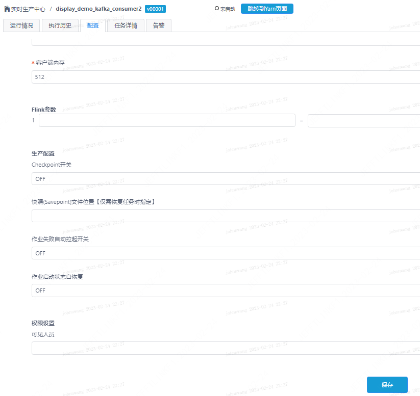 

#### 4.2.2 示例

​	streamisjobtest为flinksql文件，meta.json是该任务的元数据信息。

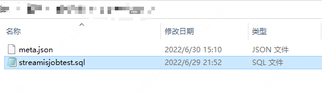

<br/>

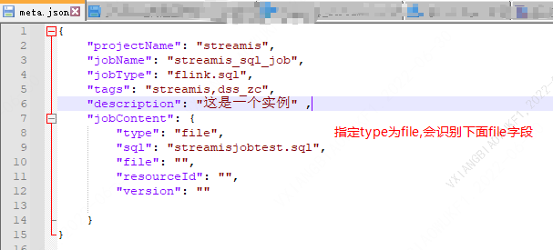

将SQL文件和meta.json文件打包成一个zip文件，注意：只能打包成zip文件，其他格式如rar、7z等格式无法识别。

如果上传zip文件出现下面错误，请调整下nginx的配置`vi /etc/nginx/conf.d/streamis.conf`，添加属性`client_max_body_size`，如下图所示。
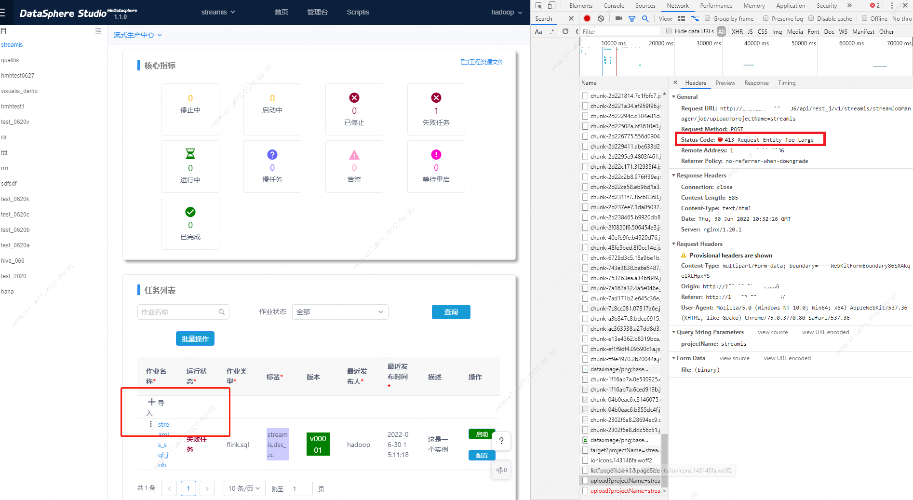
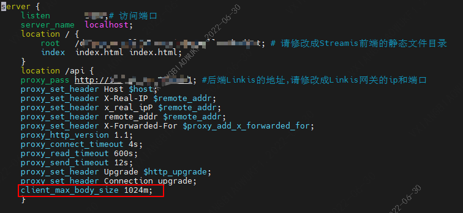
-----

在streamis中将该zip包导入，导入任务后，任务的运行状态变成"未启动",版本会+1（导入新的job任务版本从1开始），最新发布时间会更新至最新时间。

点击相应的作业名称、配置或左边3个竖点中（参数配置/告警配置/运行历史/运行日志）可进入job任务详情，点击 启动 可执行作业。

点击左边3个竖点中 快照【savepoint】 可保存快照。

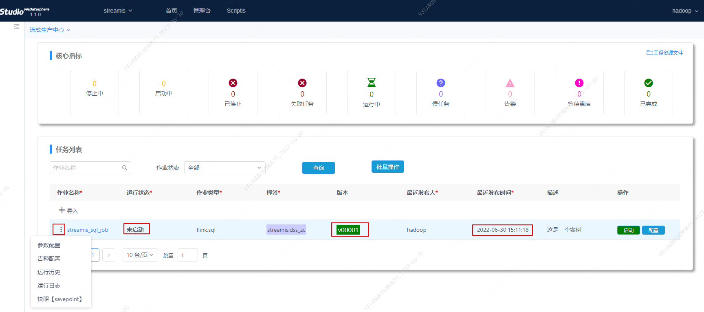

点击批量操作，可选中多个作业任务重启，快照重启会先生成快照再重新启动，直接重启不会生成快照

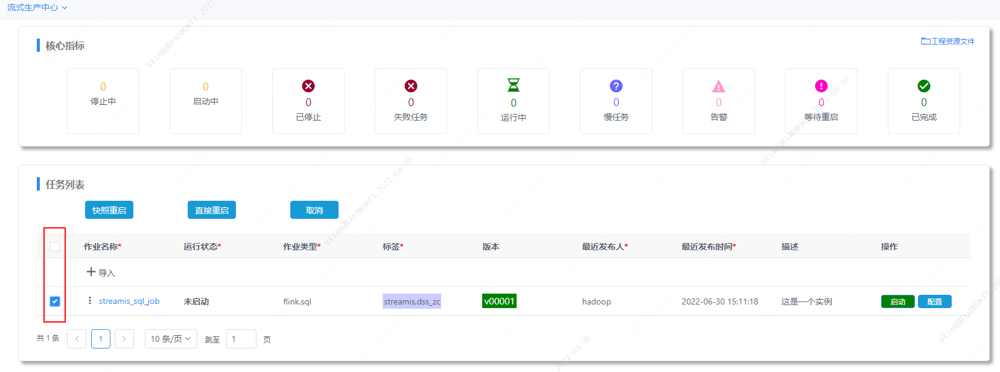

## 5. 工程资源文件

Streamis首页-核心指标右上角-工程资源文件。
工程资源文件提供了上传和管理项目所需资源文件的功能，如下图所示：

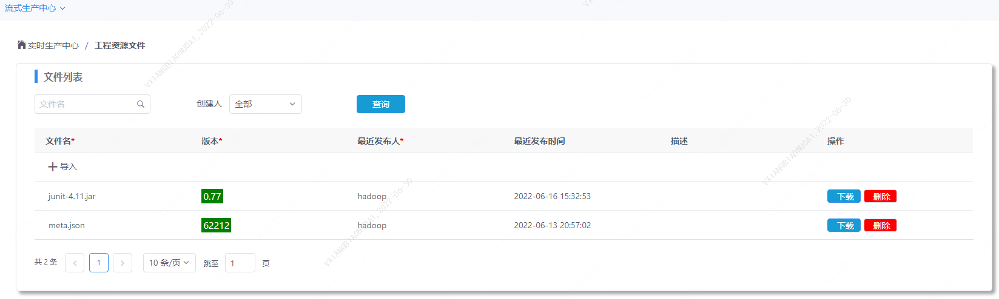

上传项目文件


## 6. Streamis任务介绍

点击”作业名称“,可查看任务的详情，包括，运行情况、执行历史、配置、任务详情、告警等。

### 5.1 运行情况

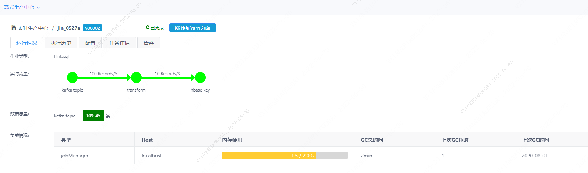

### 5.2 执行历史

打开执行历史可以查看该任务的历史运行情况，

历史日志：只有正在运行的任务才能查看历史日志。

历史日志中可以查看当前任务启动的flink引擎的日志，可以根据关键字等查看关键日志，点击查看最新日志，可以查看当前引擎的最新日志。

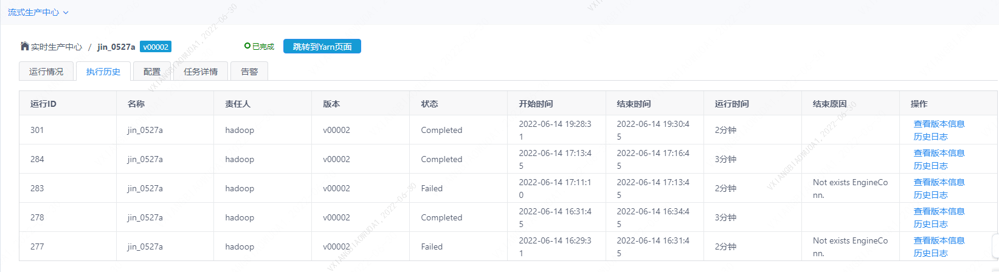

### 5.3 配置

给Streamis任务配置一些flink资源参数以及checkpoint的参数


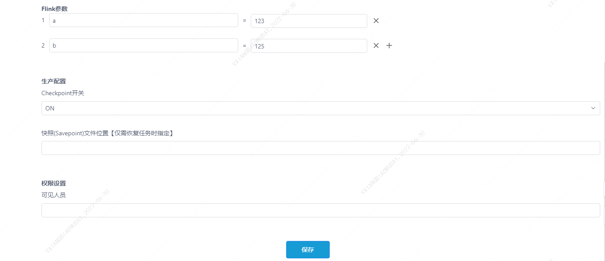


### 5.4任务详情

<br/>

&nbsp;&nbsp;任务详情根据任务类型Flink Jar 和 Flink SQL分为两种显示界面。

<br/>

- **Flink Jar任务详情**

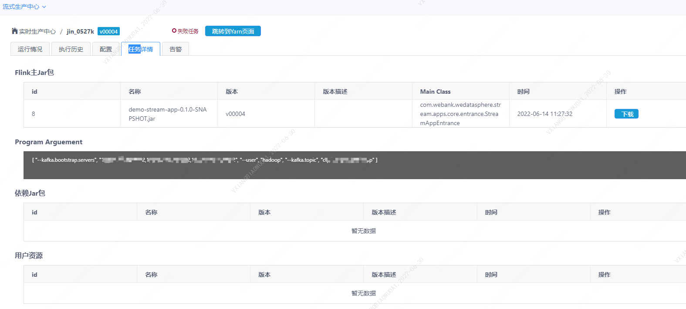

&nbsp;&nbsp;Flink Jar任务详情展示了任务Jar包的内容和参数， 同时提供下载该Jar包的功能。

<br/>

- **Flink SQL任务详情**

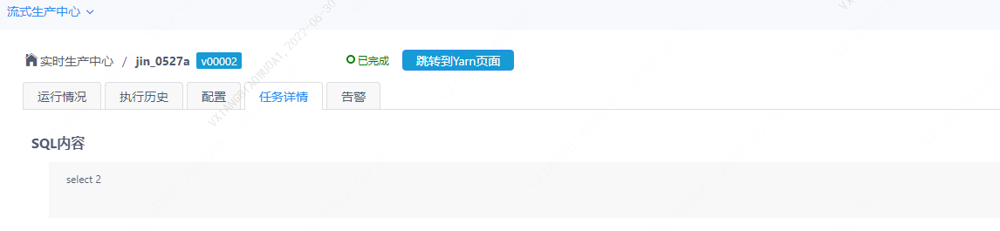

&nbsp;&nbsp;Flink SQL任务详情展示了该任务的SQL语句。

<br/>

### 5.5 进入Yarn页面

正在运行的Streamis任务可以通过该按钮进入到yarn管理界面上的查看flink任务运行情况。

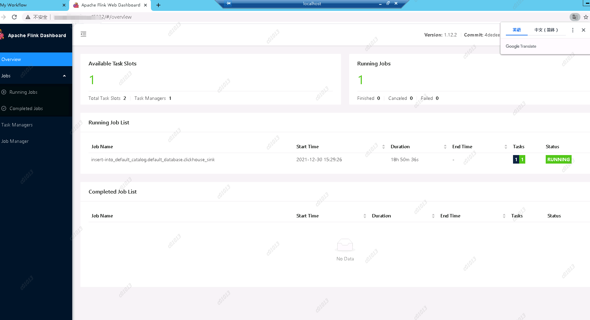

## 7. Streamis任务生命周期管理