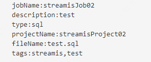
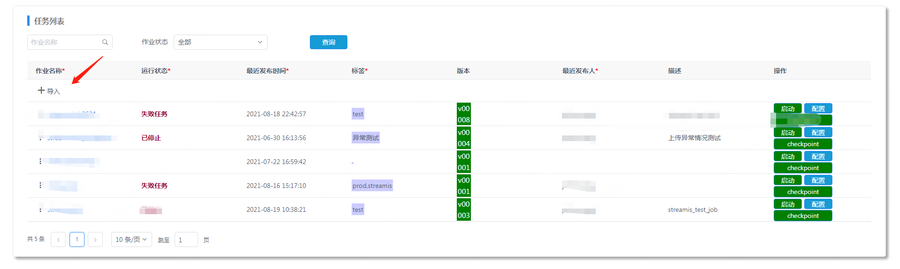
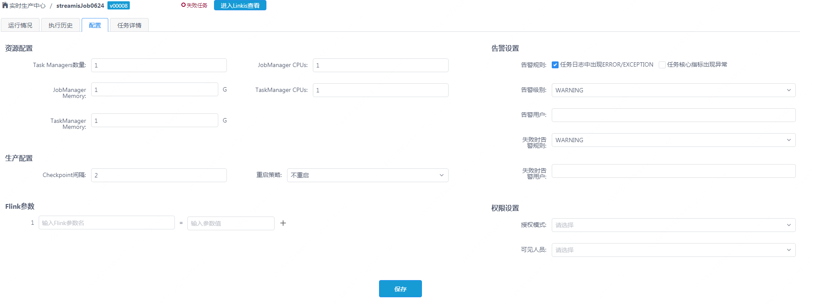
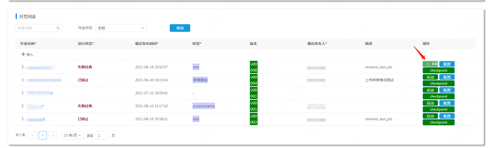

# Streamis使用文档

## 1.精简版本使用
----------

### 1.1流式应用物料包准备

流式应用物料包是指的按照Streamis打包规范，将元数据信息(流式应用描述信息),流式应用代码，流式应用使用到的物料等内容打包成zip包
#### 1.1.1 zip包的规范
zip包中包含 meta.txt 以及 ${文件名}.sql 

如：上传的zip包名为：streamis_test_01.zip，解压后包含的文件为meta.txt和${文件名}.sql。
meta.txt文件中存储任务的基本信息，具体格式和内容如下：

1. 项目名（可选）：projectName:${projectName}

注：若meta.txt中有projectName项，则该项目的项目名为${projectName}。若不包含projectName项，则该项目的项目名为zip包的包名。

例：用户上传了streamis_test_01.zip的压缩包，若其中meta.txt中有projectName:streamis_test，则projectName为streamis_test，若meta.txt中没有projectName项，则该项目的项目名为streamis_test_01。

2. 任务名（必填）：jobName:${jobName}

3. 项目类型（必填）：type:sql

注：当前版本仅支持提交flinksql类型的任务，因此type项均为sql类型。

4. 文件名（必填）：fileName:${文件名}.sql

注：sql文件。

5. 描述（可选）：description: ${description}

注：项目的描述内容。

6. 标签（可选）: tags:${tags}

注：tags为该项目的标签列表，每个标签以逗号分隔，如tags:tag1,tag2,tag3。若meta.txt中没有tags项，则默认为该项目添加标签:prod和streamis。

项目名(projectName)，任务名(jobName)，文件名(fileName)，单个标签（tag）均限制为最大长度为64字符，且仅允许输入中文，数字，英文和下划线。描述（description）长度限制为128字符，内容不做限制。
meta.txt的一个样例如下 

### 1.2流式应用物料包上传

物料打包结束之后，进入streamis流式应用管理中心,开始上传物料包 

### 1.3流式应用参数配置
物料包上传完毕之后，就可以看到已经有一个新的流式应用，点击该流式应用，可以进入配置界面 

### 1.4流式应用启停
参数等内容配置完毕之后，即可以开启流式应用 

## 2.实时数仓版本使用
----------

### 2.1流式编排创建
### 2.2流式工作流