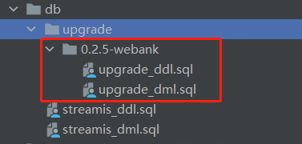

# 配置与脚本升级文档

## 配置变更

暂不涉及

## SQL变更

涉及两个数据表的结构修改以及一个数据表的数据修改，已添加到项目版本分支中，并在打包时进行包含



### 基础脚本变更

#### 1、streamis_ddl.sql

```yaml
# 对linkis_stream_job表添加一个字段current_version
 CREATE TABLE `linkis_stream_job` (
  `id` bigint(20) NOT NULL AUTO_INCREMENT,
  `project_name` varchar(100) DEFAULT NULL,
  `name` varchar(200) DEFAULT NULL,
  `status` tinyint(1) DEFAULT '0' COMMENT '1:已完成 ，2:等待重启 ，3:告警 ，4:慢任务 ，5:运行中 ，6:失败任务',
  `create_by` varchar(50) DEFAULT NULL,
  `create_time` datetime DEFAULT NULL,
  `label` varchar(200) DEFAULT NULL,
  `description` varchar(200) DEFAULT NULL,
  `job_type` varchar(30) DEFAULT NULL COMMENT '目前只支持flink.sql、flink.jar、spark.jar',
  `submit_user` varchar(100) DEFAULT NULL,
  `workspace_name` varchar(50) DEFAULT NULL,
  `current_version` varchar(50) DEFAULT NULL,
  PRIMARY KEY (`id`) USING BTREE,
  UNIQUE KEY(`project_name`, `name`)
) ENGINE=InnoDB AUTO_INCREMENT=1 DEFAULT CHARSET=utf8 ROW_FORMAT=COMPACT COMMENT='作业表';

# 对linkis_stream_job_version表添加一个字段manage_mode
CREATE TABLE `linkis_stream_job_version` (
  `id` bigint(20) NOT NULL AUTO_INCREMENT,
  `job_id` varchar(50) DEFAULT NULL,
  `version` varchar(20) DEFAULT NULL,
  `source` varchar(255) DEFAULT NULL COMMENT '这个版本的来源，比如：用户上传，由某个历史版本回退回来的',
  `job_content` text COMMENT '内容为meta.json',
  `manage_mode` varchar(30) DEFAULT 'EngineConn' COMMENT 'Manage mode',
  `comment` varchar(255) DEFAULT NULL,
  `create_time` datetime DEFAULT NULL,
  `create_by` varchar(32) DEFAULT NULL,
  PRIMARY KEY (`id`) USING BTREE,
  UNIQUE KEY(`job_id`, `version`)
) ENGINE=InnoDB AUTO_INCREMENT=1 DEFAULT CHARSET=utf8 ROW_FORMAT=COMPACT COMMENT='作业表';
```

#### 2、streamis_dml.sql

暂不涉及

### 升级脚本

#### 1、ddl升级脚本

```yaml
alter table linkis_stream_job add column `current_version` varchar(50);
alter table linkis_stream_job_version add column `manage_mode` varchar(30) default `EngineConn`;
```

#### 2、dml升级脚本

```yaml
update linkis_stream_job j set current_version = (select version from linkis_stream_job_version v where v.job_id = j.id order by id desc limit 1);
```

