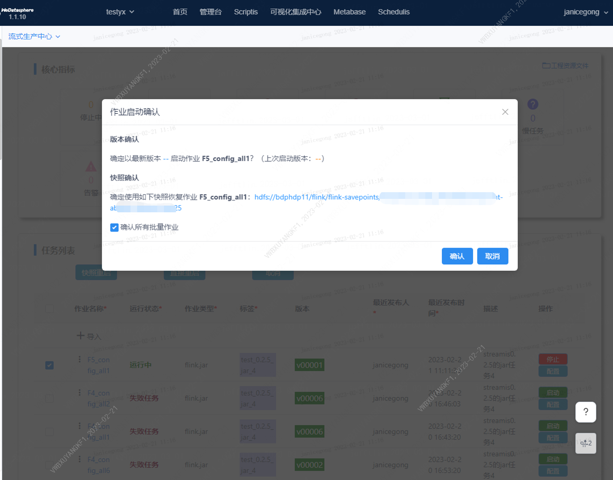

# 新版本特性文档

## 1、【流作业版本管理】streamis 应用初始化支持应用运行在线导入及版本管理

流式作业信息列表界面；增加对返回的作业详细信息的versionForwards的字段的读取，该字段代表的含义是“已发布的领先版本的数量”，如果该字段的值大于0，则在界面上版本信息的右上角做(+{数量值})显示，如下：


需要注意的，一般versionForwards字段大于零的情况，只发生在处于运行时状态的作业上，因为对运行时作业进行发布，作业的当前使用版本不会更新，所以已发布版本才会领先当前使用版本。

当点击版本值之后，则会请求作业的版本列表接口，该接口为分页接口。拿到接口返回值后渲染表格列表，其中前端新增“版本状态”字段，默认值为"---"，前端边渲染版本列表边用version字段的值和当前作业的使用版本做对比，如果一致，则版本状态更新为“使用中”（如上图）。

##  2、【流作业版本管理】streamis作业任务启动增加启动检查 

目前前端上启动作业任务有两种方式：

1）点击作业信息列表右侧的启动按钮，如下图：


2）通过两个批量操作按钮：“快照重启”和“直接重启”，如下图：


这里的逻辑是：

1、快照重启和直接重启只有调用接口时snapshot参数的区别  

2、快照重启、直接重启、启动 都需要调用inspect接口  

3、快照重启、直接重启调用inspect接口前，需要pause接口返回成功  

4、启动 不需要调用pause接口  

5、快照重启、直接重启，勾选了“确认所有批量作业”并确认，或者一直确认到最后一步(中间的某一步，如果inspections返回为[]，则表示这一步不需要确认，直接跳到下一步)，调用bulk/execution接口  

6、启动 如果inspect接口返回的inspections为[]，则直接调用execute接口 

目前启动检查只对版本(version)和快照(snapshot)做检查，版本检查将version键值对里的now最新版本和last上一个启动版本拿出来做显示：**确定以最新发布版本: ｛now.version｝ 启动作业｛job.name｝?(上次启动版本: {last.version}**；快照检查则是将snapshot键值对里的path信息提取出来，做显示: **确定使用如下快照恢复作业 {job.name} \n: {path}**。如果接口返回异常，则直接抛错 "作业启动检查失败, {message}"，同时如果inspections检查项目为空，也不必做弹窗显示。

最后要根据用户的选择，判断是否启动该作业。


对于批量重启的场景，批量启动作业之前，要为每个作业调用一次启动检查接口，并做弹窗显示；这样势必会有大量弹窗确认，所以对于批量场景，弹窗内容下方加一个"口确认所有批量作业"的可勾选项，如果用户选中后，则记录下用户这次的选项，该批量后面的所有作业可以不必发起启动检查，直接取这次的选项值即可。


## 3、【流作业配置管理】streamis应用参数配置导入需求

【背景】streamis 应用配置，现需手工录入参数配置，不方便批量配置。 

【需求】1.提供导入功能，以json包格式快速导入应用参数，用于对接AOMP发布模版，实现应用参数AOMP发布及配置2.提供应用参数配置模版引用功能，各应用的参数配置除启动资源外，大部分相同，引用其他应用快速配置 

【需求设计】此前streamis的设计是将作业应用的导入和配置项的设置区分为两个接口，分别是：1）streamis作业导入：/streamis/streamJobManager/job/upload POST mutilpart-form2）streamis作业配置项的设置：/streamis/streamJobManager/config/json/{jobId} POST application-json其中作业的导入是以文件上传的形式实现的，文件必须为zip为后缀的压缩文件，压缩文件里附有任务的定义文件meta.json，基础格式如下：

```yaml
{
	"projectName": "",  # 项目名
	"jobName": "",   # 作业名
	"jobType": "flink.sql",		# 目前只支持flink.sql、flink.jar
	"tags": "",   # 应用标签
	"description": ""    # 作业描述,
	"jobContent": {
		# 不同的jobType，其内容各不相同，具体请往下看
	}
}
```

现在我们将任务配置参数融入进定义文件meta.json中，融入后的格式如下：

```yaml
{
	"projectName": "",  # 项目名
	"jobName": "",   # 作业名
	"jobType": "flink.sql",		# 目前只支持flink.sql、flink.jar
	"tags": "",   # 应用标签
	"description": ""    # 作业描述,
	"jobContent": {
		# 不同的jobType，其内容各不相同，具体请往下看
	},
    "jobConfig": {
        "wds.linkis.flink.resource": {
    		"wds.linkis.flink.app.parallelism":"4",
    		"wds.linkis.flink.jobmanager.memory":"2048",
    		"wds.linkis.flink.taskmanager.memory":"4096",
    		"wds.linkis.flink.taskmanager.numberOfTaskSlots":"2",
    		"wds.linkis.flink.taskmanager.cpus":"2",
    		"wds.linkis.rm.yarnqueue":"queue_0301_04"
    	},
    	"wds.linkis.flink.custom": {
            "stream.log.filter.keywords":"ERROR,WARN,INFO",
            "security.kerberos.krb5-conf.path":"/appcom/Install/streamis/krb5.conf",
            "demo.log.tps.rate":"20000",
             "classloader.resolve-order":"parent-first",
             "stream.log.debug":"true",
             "security.kerberos.login.contexts":"KafkaClient,Client",
             "security.kerberos.login.keytab":"/appcom/Install/streamis/hadoop.keytab",
             "security.kerberos.login.principal":"hadoop/inddev010004@WEBANK.COM"
    	},
    	"wds.linkis.flink.produce": {
    	    "wds.linkis.flink.checkpoint.switch":"OFF",
    		"wds.linkis.flink.app.fail-restart.switch":"OFF",
    		"wds.linkis.flink.app.start-auto-restore.switch":"OFF"
    	}
    }
}
```

后台在任务创建过程中将开启事务，事务里首先进行任务插入操作，然后调用任务参数新增服务，都处理成功后，事务提交，否则回滚所有插入操作。**注明：默认参数会自动填充，非定义参数直接过滤，例如Flink自定义参数是不做校验的。**  默认参数如下：

```yaml
资源配置（默认参数）：
wds.linkis.flink.app.parallelism: "4"
wds.linkis.flink.jobmanager.memory: "1024"
wds.linkis.flink.taskmanager.cpus: "2"
wds.linkis.flink.taskmanager.memory: "4096"
wds.linkis.flink.taskmanager.numberOfTaskSlots: "2"
wds.linkis.rm.yarnqueue: ""
Flink参数（自定义参数）：
配置项为空
生产配置（默认参数）：
wds.linkis.flink.app.fail-restart.switch: "OFF"
wds.linkis.flink.app.start-auto-restore.switch: "OFF"
wds.linkis.flink.checkpoint.switch: "OFF"
wds.linkis.flink.savepoint.path: ""
权限设置：
wds.linkis.flink.authority.visible: ""
```

## 4、【驱动管理】检查点自恢复策略优化调整

**需求背景：**在对作业任务的检查点(checkpoint/savepoint)进行自恢复的过程中碰到问题：如果任务连续发生多次重启恢复，由于每次只能获取上个时间点任务的检查点，当重启后的任务在创建检查点之前异常退出，那么后续再重启的任务就会因为无法获得检查点信息，而造成数据的丢失。

**需求设计：**上述需求问题需要对streamis的检查点自恢复策略进行调整，每次任务成功启动，都不应该丢弃使用过的检查点信息，要传递到下一个任务中去。为实现检查点信息能够在作业任务之间进行传递，我们要做如下设计：

1）每次任务启动的时候，把选定的检查点(checkpoint/savepoint)相关信息保存在任务的jobInfo对象属性里去，每次任务成功launch后，持久化jobInfo对象。

2）任务启动恢复的时候，从三个地方查找检查点数据，一个是根据任务的jobInfo字段反解析后得到的map对象，一个是任务的checkpoint路径，最后一个是任务的savepoint路径；把三个地方获得的检查点数据放在一起排序，取创建/修改时间最新的一位。


如上图，任务在16:54启动时用的是最新的savepoint文件启动3）如果是用户配置了快照路径或在弹窗中确认了快照路径，则为最高优先级





