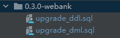

# 配置与脚本升级文档

## 配置变更

暂不涉及

## SQL变更

涉及两个数据表的结构修改以及一个数据表的数据修改，已添加到项目版本分支中，并在打包时进行包含



### 基础脚本变更

#### 1、streamis_ddl.sql

```yaml
# 对linkis_stream_project_files 表添加两个字段update_time 和 md5
  CREATE TABLE `linkis_stream_project_files` (
    `id` bigint(20) NOT NULL AUTO_INCREMENT,
    `file_name` varchar(500) DEFAULT NULL,
    `version` varchar(30) DEFAULT NULL COMMENT '文件版本号，由用户上传时指定的',
    `store_path` varchar(100) DEFAULT NULL COMMENT '如：{"resource":"22edar22", "version": "v0001"}',
  `store_type` varchar(20) DEFAULT NULL COMMENT '存储类型，一般就是bml',
    `project_name` varchar(50) DEFAULT NULL,
    `create_time` datetime DEFAULT CURRENT_TIMESTAMP,
    `create_by` varchar(32) DEFAULT NULL,
    `comment` varchar(255) DEFAULT NULL COMMENT '说明',
    `update_time` datetime DEFAULT NULL,
    `md5` varchar(100) DEFAULT NULL COMMENT '文件md5',
    PRIMARY KEY (`id`) USING BTREE
    ) ENGINE=InnoDB AUTO_INCREMENT=1 DEFAULT CHARSET=utf8 ROW_FORMAT=COMPACT COMMENT='项目表';
 
```

#### 2、streamis_dml.sql

暂不涉及

### 升级脚本

#### 1、ddl升级脚本

```yaml
ALTER TABLE linkis_stream_project_files ADD update_time datetime NULL;
ALTER TABLE linkis_stream_project_files ADD md5 varchar(100) NULL;
```

#### 2、dml升级脚本

```yaml
UPDATE linkis_stream_job_config_def
SET `key`='wds.linkis.flink.alert.failure.user', name='失败时告警用户', `type`='INPUT', sort=0, description='失败时告警用户', validate_type='None', validate_rule=NULL, `style`='', visiable=1, `level`=1, unit=NULL, default_value='', ref_values='', parent_ref=8, required=0, is_temp=0
WHERE id=16;

INSERT INTO `linkis_stream_job_config_def` VALUES (38, 'linkis.ec.app.manage.mode', '管理模式', 'SELECT', 3, 'EngineConn管理模式', 'None', NULL, '', 1, 1, NULL, 'attach', 'detach,attach', 8, 0, 0);

```

