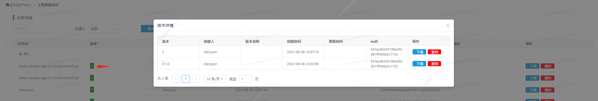
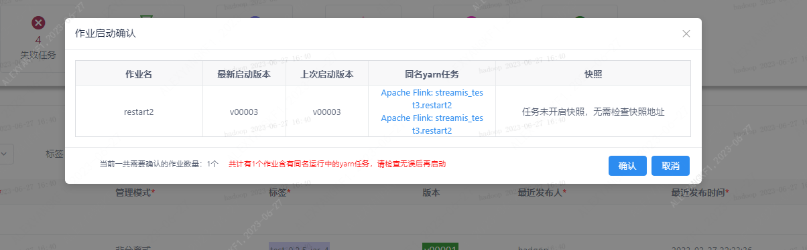

### 1. 分离式特性重构
0.3.0版本对分离式flink引擎特性进行重构，支持分离式提交。提交后linkis flink引擎在yarn flink应用创建成功后，自动退出，释放jvm资源。streamis继续对yarn上flink 应用进行生命周期管理。


从0.3.0起，任务默认是非分离式，如果要改为分离式，有如下两种方式
###### ①导入时生产参数增加配置参数   linkis.ec.app.manage.mode  ，值  detach - 分离式 ， attach - 非分离式（默认）
```
"wds.linkis.flink.produce": {
		"wds.linkis.flink.checkpoint.switch":"ON",
		"wds.linkis.flink.alert.failure.user":"alexyang",
		"wds.linkis.flink.app.fail-restart.switch":"OFF",
		"wds.linkis.flink.app.start-auto-restore.switch":"OFF",
		"linkis.ec.app.manage.mode": "detach"
	}
```

###### ②在任务配置页面，将管理模式改为  detach


### 2. 标签筛选
支持继续标签筛选任务


###3. 标签批量修改

先点批量修改，然后选中多个任务，点 修改标签。在弹出窗口输入新标签内容，支持大小写字母、数字、逗号、下划线。


### 4. 上传job zip包自动清理
导入任务后，在服务端的zip 缓存会自动清理

### 5. 任务启动前检查失败告警人

失败告警人必须为非hduser用户，否则不能启动。
可以在导入任务时，或者任务配置界面配置告警人：
###### ①导入任务，生产配置里配置告警人    wds.linkis.flink.alert.failure.user
```
"wds.linkis.flink.produce": {
		"wds.linkis.flink.checkpoint.switch":"ON",
		"wds.linkis.flink.alert.failure.user":"alexyang",
		"wds.linkis.flink.app.fail-restart.switch":"OFF",
		"wds.linkis.flink.app.start-auto-restore.switch":"OFF",
		"linkis.ec.app.manage.mode": "detach"
	}
```

### 6. 上传项目资源文件添加md5
在项目资源管理页面，上传的文件会有更新时间及对应md5值，md5值跟linux命令行结果一致




### 7. 启动作业时，会自动检查yarn上同名应用
点击应用名，可以跳转到yarn页面


